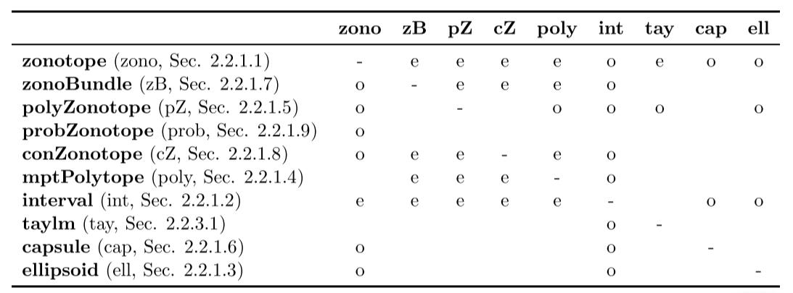
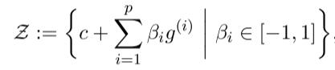
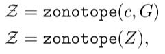
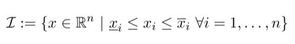
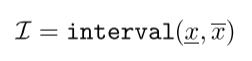
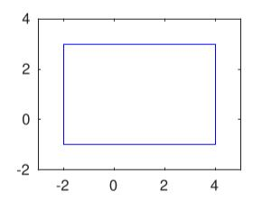

# Chapter2. Set Representations and Operations

[TOC]


## 2.1 Set Operations

### 2.1.1 Basic Set Operations

#### 2.1.1.1 mtimes


#### 2.1.1.2 plus


#### 2.1.1.3 cartProd


#### 2.1.1.4 convHull


#### 2.1.1.5 quadMap


#### 2.1.1.6 and


#### 2.1.1.7 or


### 2.1.2 Predicates

#### 2.1.2.1 in


#### 2.1.2.2 isIntersecting


#### 2.1.2.3 isFullDim


#### 2.1.2.4 isequal


#### 2.1.2.5 isempty


### 2.1.3 Set Properties

#### 2.1.3.1 center


#### 2.1.3.2 dim


#### 2.1.3.3 norm


#### 2.1.3.4 vertices


#### 2.1.3.5 volume


### 2.1.4 Auxiliary Operations

#### 2.1.4.1 cubMap


#### 2.1.4.2 enclose


#### 2.1.4.3 enclosePoints


#### 2.1.4.4 generateRandom


#### 2.1.4.5 randPoint


#### 2.1.4.6 reduce


#### 2.1.4.7 supportFunc


#### 2.1.4.8 plot


#### 2.1.4.9 project


## 2.2 Set Representations

> 可达性分析对集合表示的要求：
>
> - 足以能够精准得描述可达性集合
> - 需要能够保证运行效率和可伸缩性


CORA支持内部某些集合表示之间进行相互转化，只需要将一个集合的实例交给另一个集合的构造器即可。下图为不同集合表示方法之间进行相互转换的关系。

> o: over-approximatation(超精度转换)
>
> e: exact conversion(精准转换)




集合表示转换示例

```matlab
% 创建 zonotope 对象
zono = zonotope([1 2 1;0 1 -1]);

% 转换为其他的集合表示
% 转换为interval(o)
int = interval(zono);
% 转换为polytope(e)
poly = mptPolytope(zono);
```


### 2.2.1 Basic Set Representations

#### 2.2.1.1 Zonotopes

> zonotope是一种紧凑的(compact)，用于表示高维空间的表示法。实际上，zonotope可以被看做数个线段的闵可夫斯基加和


###### n维空间上的zonotope定义



> c：中心点
>
> g<sup>(i)</sup>：generator(发生器)


###### CORA中zonotope的声明方式



> G = [g(1),g(2),......g(p)]


#### 2.2.1.2 Intervals

> interval(区间)，是一个n维空间上的连通子集，使用上下界来进行定义


###### n维空间上的interval定义




###### CORA中interval的声明方式



> 注意，上下界均可以不止一个，以便表示不同维度中的interval


###### 示例

```matlab
% construct interval 
% 注意，-2~4为一组，-1~3为一组
lb = [-2; -1];
ub = [4; 3];
int = interval(lb,ub);
```




#### 2.2.1.3 Ellipsoids


#### 2.2.1.4 MPT Polytopes


#### 2.2.1.5 Polynomial Zonotopes


#### 2.2.1.6 Capsules


#### 2.2.1.7 Zonotope Bundles


#### 2.2.1.8 Constrained Zonotopes


#### 2.2.1.9 Probabilistic Zonotopes


### 2.2.2 Auxiliary Set Representations

#### 2.2.2.1 Constrained Hyperplane

#### 2.2.2.2 Halfspace

#### 2.2.2.3 Level Sets

### 2.2.3 Set Representations for Range Bounding

#### 2.2.3.1 Taylor Models

#### 2.2.3.2 Affine

#### 2.2.3.3 Zoo