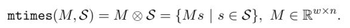
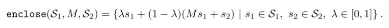
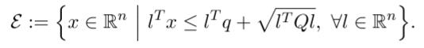
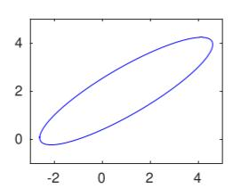
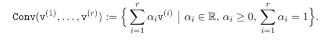

# Chapter2. Set Representations and Operations


- [Chapter2. Set Representations and Operations](#chapter2-set-representations-and-operations)
  - [2.1 Set Operations](#21-set-operations)
    - [2.1.1 Basic Set Operations](#211-basic-set-operations)
      - [2.1.1.1 mtimes](#2111-mtimes)
      - [2.1.1.2 plus](#2112-plus)
      - [2.1.1.3 cartProd](#2113-cartprod)
      - [2.1.1.4 convHull](#2114-convhull)
      - [2.1.1.5 quadMap](#2115-quadmap)
      - [2.1.1.6 and](#2116-and)
      - [2.1.1.7 or](#2117-or)
    - [2.1.2 Predicates](#212-predicates)
      - [2.1.2.1 in](#2121-in)
      - [2.1.2.2 isIntersecting](#2122-isintersecting)
      - [2.1.2.3 isFullDim](#2123-isfulldim)
      - [2.1.2.4 isequal](#2124-isequal)
      - [2.1.2.5 isempty](#2125-isempty)
    - [2.1.3 Set Properties](#213-set-properties)
      - [2.1.3.1 center](#2131-center)
      - [2.1.3.2 dim](#2132-dim)
      - [2.1.3.3 norm](#2133-norm)
      - [2.1.3.4 vertices](#2134-vertices)
      - [2.1.3.5 volume](#2135-volume)
    - [2.1.4 Auxiliary Operations](#214-auxiliary-operations)
      - [2.1.4.1 cubMap](#2141-cubmap)
      - [2.1.4.2 enclose](#2142-enclose)
      - [2.1.4.3 enclosePoints](#2143-enclosepoints)
      - [2.1.4.4 generateRandom](#2144-generaterandom)
      - [2.1.4.5 randPoint](#2145-randpoint)
      - [2.1.4.6 reduce](#2146-reduce)
      - [2.1.4.7 supportFunc](#2147-supportfunc)
      - [2.1.4.8 plot](#2148-plot)
      - [2.1.4.9 project](#2149-project)
  - [2.2 Set Representations](#22-set-representations)
    - [2.2.1 Basic Set Representations](#221-basic-set-representations)
      - [2.2.1.1 Zonotopes](#2211-zonotopes)
          - [1.n维空间上的zonotope定义](#1n维空间上的zonotope定义)
          - [2.CORA中zonotope的声明方式](#2cora中zonotope的声明方式)
          - [3.代码示例](#3代码示例)
          - [4.zonotope的产生过程](#4zonotope的产生过程)
      - [2.2.1.2 Intervals（区间）](#2212-intervals区间)
          - [1.n维空间上的interval定义](#1n维空间上的interval定义)
          - [2.CORA中interval的声明方式](#2cora中interval的声明方式)
          - [示例](#示例)
      - [2.2.1.3 Ellipsoids（椭圆体）](#2213-ellipsoids椭圆体)
          - [1.nxn空间上Ellipsoids的定义](#1nxn空间上ellipsoids的定义)
          - [2.CORA中ellipsoids的声明方式](#2cora中ellipsoids的声明方式)
          - [3.示例](#3示例)
      - [2.2.1.4 MPT Polytopes（MPT多面体）](#2214-mpt-polytopesmpt多面体)
      - [2.2.1.5 Polynomial Zonotopes（多项的zonotope)](#2215-polynomial-zonotopes多项的zonotope)
      - [2.2.1.6 Capsules（胶囊）](#2216-capsules胶囊)
      - [2.2.1.7 Zonotope Bundles (zonotope束)](#2217-zonotope-bundles-zonotope束)
      - [2.2.1.8 Constrained Zonotopes](#2218-constrained-zonotopes)
      - [2.2.1.9 Probabilistic Zonotopes](#2219-probabilistic-zonotopes)
    - [2.2.2 Auxiliary Set Representations](#222-auxiliary-set-representations)
      - [2.2.2.1 Constrained Hyperplane](#2221-constrained-hyperplane)
      - [2.2.2.2 Halfspace](#2222-halfspace)
      - [2.2.2.3 Level Sets](#2223-level-sets)
    - [2.2.3 Set Representations for Range Bounding](#223-set-representations-for-range-bounding)
      - [2.2.3.1 Taylor Models](#2231-taylor-models)
      - [2.2.3.2 Affine](#2232-affine)
      - [2.2.3.3 Zoo](#2233-zoo)

## 2.1 Set Operations

> CORA中实现的可达性算法依赖基于集合的计算。一个重要的设计原则是，对于不同的集合表示方法，基本的集合操作是一致的，这样能够保证可达性算法可以适用于不同的集合表示法。


### 2.1.1 Basic Set Operations

2.1.1中介绍基本的集合操作


#### 2.1.1.1 mtimes

mtimes重载了"*"操作，实现了集合的线性映射


##### 1.定义

对于R<sup>n</sup>上的集合S，mtimes的定义如下：




##### 2.示例

```matlab
% set and matrix 
S = zonotope([0 1 1 0; ... 0 1 0 1]);
M = [1 0; -1 0.5];

% linear transformation
res = M * S;
```


#### 2.1.1.2 plus

> plus重载了"+"操作，实现了两个集合的闵可夫斯基和，注意不是plus操作不等于"and"


##### 1.定义

对于R<sup>n</sup>的子集S1，S2，它们的plus操作定义如下


##### 2.示例

```matlab
% set S1 and S2 
S1 = zonotope([0 0.5 1; ... 0 1 0]);
S2 = zonotope([0 1 0; ... 0 0 1]);

% Minkowski sum
res = S1 + S2;
```


> 左图为S1与S2的交集，右图为它们的闵可夫斯基和


#### 2.1.1.3 cartProd(Cartesian Product 笛卡尔积)

> cartProd实现了两个集合的笛卡尔积操作(即两个集合各个元素两两组合)


##### 1.定义


> S1 $\subset$ R<sup>n</sup>
>
> S2 $\subset$ R<sup>w</sup>


##### 2.示例

```matlab
% set S1 and S2 
S1 = interval(-2,1); 
S2 = interval(-1,2);

% Cartesian product
res = cartProd(S1,S2)
```


#### 2.1.1.4 convHull(convex hull 凸包)

> convHull实现了两个集合的凸包操作
>
> tips:
>
> ###### 凸包
>
> 凸包（Convex Hull）是一个计算几何（图形学）中的概念。
>
> 在一个[实数](https://baike.baidu.com/item/实数/296419)[向量空间](https://baike.baidu.com/item/向量空间/5936597)V中，对于给定集合X，所有包含X的[凸集](https://baike.baidu.com/item/凸集/6105027)的[交集](https://baike.baidu.com/item/交集/5017305)S被称为X的**凸包**。X的凸包可以用X内所有点(X1，...Xn)的[凸组合](https://baike.baidu.com/item/凸组合)来构造.
>
> 在二维[欧几里得空间](https://baike.baidu.com/item/欧几里得空间)中，凸包可想象为一条刚好包著所有点的橡皮圈。
>
> 用不严谨的话来讲，给定二维平面上的点集，凸包就是将最外层的点连接起来构成的[凸多边形](https://baike.baidu.com/item/凸多边形/6608474)，它能包含点集中所有的点。


##### 1.定义

对于两个R<sup>n</sup>子集S1，S2，其凸包被定义为


##### 2.示例

```matlab
% set S1 and S2 
S1 = conZonotope([1.5 1 0; ... 1.5 0 1]);
S2 = conZonotope([-1.5 1 0; ... -1.5 0 1]);

% convex hull
res = convHull(S1,S2);
```


#### 2.1.1.5 quadMap

> quadMap方法实现了一个集合的二次函数


##### 1.定义

对于R<sup>n</sup>的子集S1，其二次函数定义为


> s：进行计算的集合
>
> Q：计算时需要提供的矩阵


当提供两个集合进行运算时，计算的就是两个集合混合的二次函数，定义如下


##### 2.示例

```matlab
% set and matrices 
S = polyZonotope([0;0], ... [1 1;1 0], ... [],eye(2));
Q{1} = [0.5 0.5; 0 -0.5];
Q{2} = [-1 0; 1 1];

% quadratic map
res = quadMap(S,Q);
```


#### 2.1.1.6 and

> and方法重载了”&“运算符，计算两个集合的交集


##### 1.定义


##### 2.示例

```matlab
% set S1 and S2 
S1 = interval([-1;-1],[2;2]);
S2 = interval([-2;-2],[1;1]);

% intersection
res = S1 & S2;
```


#### 2.1.1.7 or

> or方法重载了”|“运算符，表示两个集合的并集运算


##### 1.定义


##### 2.示例

```matlab
% set S1 and S2 
S1 = interval([-2;-1],[2;2]); 
S2 = interval([-2;-2],[2;1]);

% union
res = S1 | S2;
```


不同集合表示的集合运算，采取的精度如下

e：exact computation

o：over-approximation


### 2.1.2 Predicates(谓词运算)

> 谓词运算检查一个集合是否满足特定的要求，返回0或1


#### 2.1.2.1 in

> in方法检查一个集合是否被另一个集合包含


##### 1.定义

对于R<sup>n</sup>的子集S1，S2，in方法的定义如下


- 除了判断两个集合之间的关系，in运算还可以被用于判断一个点是否在某个集合中。

- 由于精确的in计算可能会导致较大的开销，因此可以使用近似计算来减少某些情况下的开销，即如果比S2更大的集合都能确定在S1中，S2也必然在S1中，这种情况需要说明"approx"

  `in(S1,S2,'approx')`


##### 2.示例

```matlab
% sets S1,S2, and point p 
S1 = zonotope([0 1 1 0; ... 0 1 0 1]);
S2 = interval([-1;-1],[1;1]); 
p = [0.5;0.5];

% containment check res1 = in(S1,S2)
res2 = in(S1,p)
```


tips:不同集合之间可以进行的in运算如下：

(行：S2 ； 列：S1)


#### 2.1.2.2 isIntersecting

> isIntersecting方法检查两个集合是否相交


##### 1.定义

对于R<sup>n</sup>的子集S1，S2，isIntersecting方法的定义如下，其返回值为0或1


与in类似，isIntersecting也提供近似运算

`isIntersecting(S1,S2,'approx');`


##### 2.示例

```matlab
% sets S1 and S2 
S1 = interval([-1;-1],[2;2]); 
S2 = interval([-2;-2],[1;1]);

% intersection check
res = isIntersecting(S1,S2)
```


tips：不同集合之间可以进行的运算如下(与in的表格格式一致)


#### 2.1.2.3 isFullDim

> isFullDim操作检查一个集合是否是full-dimensional的，返回值为0或1


1.定义


> $\beta$是unit ball，其定义为：`B = {x | ||x||2 ≤ 1}`


2.示例

```matlab
% sets S1 and S2 
S1 = zonotope([1 2 1;3 1 2]); 
S2 = zonotope([1 2 1;3 4 2]);

% check if full-dimensional 
res = isFullDim(S1)
res = isFullDim(S2)
```


#### 2.1.2.4 isequal

> isequal方法检查两个集合是否是相等的


##### 1.定义


##### 2.示例

```matlab
% sets S1 and S2 
S1 = zonotope([0 1 1 0; ... 0 1 0 1]);
S2 = zonotope([0 1 1 0; ... 0 1 0 1]);

% equality check
res = isequal(S1,S2)
```


#### 2.1.2.5 isempty

> isempty方法检查一个集合是否为空


##### 1.定义


##### 2.示例

```matlab
% set S (intersection) 
S1 = mptPolytope(... [-1 -1;0 -1;0 1;1 1], ... [-0.5; 0; 2; 2.5]);
S2 = mptPolytope(... [-1 -1;0 -1;0 1;1 1], ... [2.5; 2; 0; -0.5]);
S = S1 & S2;

% check if set is empty
res = isempty(S)
```


### 2.1.3 Set Properties

> 此部分介绍计算集合的几何属性的方法（如中心、维度、范数等）


#### 2.1.3.1 center

> center方法返回集合的中心点


##### 1.示例

```matlab
% set S 
S = interval([-2;-2],[1;1]);

% compute center
res = center(S)
```


#### 2.1.3.2 dim

> dim方法返回集合的维度

```matlab
% set S 
S = zonotope([0 1 0 2; ... 3 1 1 0; ... 1 1 0 1]);

% dimension of the set
res = dim(S)
```

结果：res = 3


#### 2.1.3.3 norm

> norm方法返回集合中点的最大向量范数值


##### 1.定义


> p：决定使用哪一范数，如p=2时，表示使用向量的二范数


##### 2.示例

```matlab
% set S 
S = zonotope([-0.5 1.5 0; ... -0.5 0 1.5]);

% norm of the set
res = norm(S,2)
```


#### 2.1.3.4 vertices

> vertices方法会返回一个集合的所有顶点


##### 1.定义

`[v1, . . . , vq] = vertices(S)`


##### 2.示例

```matlab
% set S 
S = interval([-2;-2], ... [1;1]);

% compute vertices
V = vertices(S)

%print result
disp(V)
```


#### 2.1.3.5 volume(体积)

> volume方法返回集合的体积
>
> （对于二维空间中的集合，即体现为面积）


##### 1.示例

```matlab
% set S 
S = zonotope([0 1 1 0; ... 0 1 0 1]);
% volume of the set
res = volume(S)
```


### 2.1.4 Auxiliary Operations

#### 2.1.4.1 cubMap

> cubMap方法实现了集合的三次函数，可以理解为该集合进行了三次运算：
>
> 集合体现为一个向量0
>
> 1. 转置的向量0<sup>T</sup>和矩阵相乘，得到一个向量1
> 2. 向量1和未转置的向量0相乘，得到一个数值
> 3. 用向量0的各个位置上的值和数值相乘，得到最终结果
>
> Tips:如果输入了三个不同的集合，即代表三个位置上的向量是不同的集合


##### 1.定义

###### (1)一个集合


###### (2)三个集合


##### 2.示例

```matlab
% set and matrices 
S = polyZonotope([0;0], ... [1 1;1 0], ... [],eye(2));

T{1,1} = 0.4*[1 2; -1 2]; 
T{1,2} = 0.4*[-3 0; 1 1]; 
T{2,1} = 0.05*[2 0; -2 1]; 
T{2,2} = 0.05*[-3 0; -21 -1];

% cubic map
res = cubMap(S,T);
```


#### 2.1.4.2 enclose

> enclose操作计算一个集合的enclosure和它的线性变换。


##### 1.定义

给定R<sup>n</sup>上的两个集合S1，S2，以及mXn的矩阵M，其enclose的定义如下




enclose方法也支持传入两个集合，不传入矩阵，这种情况下，矩阵3就被视为是计算的中间结果


##### 2.示例

```matlab
% sets S1,S2 and matrix M 
S1 = polyZonotope([1.5;1.5], ... [1 0;0 1], ... [],eye(2));
S2 = [0.5;0.5]; 
M = [-1 0;0 -1];

% apply method enclose S3 = M*S1 + S2;
res = enclose(S1,M,S2);
res = enclose(S1,S3);
```


#### 2.1.4.3 enclosePoints

> enclosePoints计算的是，能够包括点云的尽可能小的集合


##### 1.定义

给定一个点云P = [p1, . . . , pm], pi ∈ R<sup>n</sup>,enclosePoints方法定义如下


##### 2.示例

```matlab
% random point cloud 
mu = [0 0]; 
sigma = [0.3 0.4; 0.4 1]; 
points = mvnrnd(mu,sigma,100)’;

% compute enclosing set
S = ellipsoid.enclosePoints(points);
```


#### 2.1.4.4 generateRandom

> generateRandom方法根据输入的参数生成一个随机的集合


##### 1.示例

```matlab
% generate random set 
S = interval.generateRandom(2)
```


#### 2.1.4.5 randPoint

> randPoint方法返回集合中的一个随机点
>
> p = randPoint(S), p ∈ S.


##### 1.示例

```matlab
% set S 
S = zonotope([0 1 1 0; ... 0 1 0 1]);

% random point
p = randPoint(S)
```


#### 2.1.4.6 reduce

> reduce方法被用于将一个集合缩小为一个更小的集合


##### 1.定义

对于R<sup>n</sup>上的集合S，其reduce方法的定义如下


> - method：应用在集合S上的压缩算法
> - order：对结果集合S_的大小的一种预计值


##### 2.示例

```matlab
% set S 
S = zonotope([0 1 1 0; ... 0 1 0 1]);

% reduce rep. size
S_ = reduce(S,’pca’,1);
```


##### Tips：

> 对于Zonotope这种集合，可以应用的压缩方法如下
>
> 


#### 2.1.4.7 supportFunc

> supportFunc方法计算集合在某一方向上的support function


##### 1.定义

给定集合S∈R<sup>n</sup>，向量l∈R<sup>n</sup>，其support function被定义为


此方法同时也支持对下界的计算，可以通过传入一个参数’lower‘实现


##### 2.示例

```matlab
% set S and vector l 
S = zonotope([0 1 1 0; ... 0 1 0 1]);
l = [1;2];

% compute support function
res = supportFunc(S,l)
```


#### 2.1.4.8 plot

> plot可以将一个集合进行2维的边界的投影

对于一个R<sup>n</sup>的子集S，plot支持以下的语法

```matlab
han = plot(S) 
han = plot(S, dim) 
han = plot(S, dim, linespec),
han = plot(S, dim, namevaluepairs)
```

han是matlab中图形对象的一个规划好的句柄，其余的参数意义如下：

- S：集合
- dim：一个整数向量，∈N<sup>2</sup> ,用于指出选择哪两个维度进行投影。比如，默认值为[1,2]
- linespec：可选项，线段规格说明
- namevaluepairs：可选项，用于进行更多的属性设置，比如”’LineWidth‘，2 “ ，用于说明线段的宽度

##### 1.示例
```matlab
% set S 
S = zonotope([0 1 1 0; ... 0 1 2 1; ... 0 1 0 1]);
% visualization
plot(S,[1,3],’r’);
```


#### 2.1.4.9 project
> project方法被用于将一个集合S投影到一个更低维度的、轴对称的子空间

##### 1.定义
对于一个R<sup>n</sup>的子集S，以及一个表示子空间的指数dim的向量，project方法的定义如下

其中S<sub>(i)<sub>表示vector s的第i项

##### 2.示例
```matlab
% set S 
S = interval([1;2;5;0], ... [3;3;7;2]);
% projection
res = project(S,[1 3 4]);
```


> 此处可以发现，project方法在此处即体现为将第1、3、4维度的值抽取出来


## 2.2 Set Representations

> 可达性分析对集合表示的要求：
>
> - 足以能够精准得描述可达性集合
> - 需要能够保证运行效率和可伸缩性


CORA支持内部某些集合表示之间进行相互转化，只需要将一个集合的实例交给另一个集合的构造器即可。下图为不同集合表示方法之间进行相互转换的关系。

> o: over-approximatation(超精度转换)
>
> e: exact conversion(精准转换)


集合表示转换示例

```matlab
% 创建 zonotope 对象
zono = zonotope([1 2 1;0 1 -1]);

% 转换为其他的集合表示
% 转换为interval(o)
int = interval(zono);
% 转换为polytope(e)
poly = mptPolytope(zono);
```


### 2.2.1 Basic Set Representations

#### 2.2.1.1 Zonotopes

> zonotope是一种紧凑的(compact)，用于表示高维空间中的集合。实际上，zonotope可以被看做数个线段的闵可夫斯基加和。
>
> tips：实际上，zonotope可以看作为数个变量的可能取值，通过一个中心点+数个噪声变量的形式表示


##### 1.n维空间上的zonotope定义


> c：中心点
>
> g<sup>(i)</sup>：generator(发生器)


##### 2.CORA中zonotope的声明方式


> G = [g(1),g(2),......g(p)]


##### 3.代码示例

```matlab
% construct zonotope 
c = [1;1]; 
G = [1 1 1; 1 -1 0];
zono = zonotope(c,G);
```


##### 4.zonotope的产生过程

> 以3中的定义为例：
>
> 1. 以c点作为中心点
> 2. 向(1,1),(-1,-1)两个方向进行一次移动，得到一条线段
> 3. 线段上的所有点向(1,-1),(-1,1)两个方向进行一次移动，得到一个正方形
> 4. 正方形上的所有点向(1,0),(-1,0)两个方向进行一次移动，得到一个六边形


#### 2.2.1.2 Intervals（区间）

> interval(区间)，是一个n维空间上的连通子集，使用上下界来进行定义


##### 1.n维空间上的interval定义


##### 2.CORA中interval的声明方式


> 注意，上下界均可以不止一个，以便表示不同维度中的interval


###### 示例

```matlab
% construct interval 
% 注意，-2~4为一组，-1~3为一组
lb = [-2; -1];
ub = [4; 3];
int = interval(lb,ub);
```


#### 2.2.1.3 Ellipsoids（椭圆体）

> 椭圆体是一个R<sup>n</sup>维度上的几何学对象，由一个中心q和一个正的、半正定的对称矩阵定义


##### 1.nxn空间上Ellipsoids的定义




> 上述两种定义方式等价


##### 2.CORA中ellipsoids的声明方式


##### 3.示例

```matlab
% construct 
ellipsoid Q = [13 7; 7 5]; 
q = [1; 2];
E = ellipsoid(Q,q);
```




#### 2.2.1.4 MPT Polytopes（MPT多面体）

> 表示多面体的方法有两种：
>
> 1. 半空间表示法（H-repre）
> 2. 顶点表示法（V-repre)


##### 1.定义

###### 2.2.1.4.1 H-repre

> 半空间表示法通过多个半空间交集的形式表示多面体

多面体P的定义：``H(i): P = H(1) ∩ H(i) ∩ . . . ∩ H(q)``


==半空间==

> 一个半空间是使用超平面，二等分一个n维的欧几里得空间得到的

超平面的定义：``S := {x|cTx = d}, c ∈ Rn, d ∈ R``

其中

- C:超平面的法向量 
- d:超平面上任意一点与法向量的纯量积

根据超平面，可得半空间的定义：``H := {x|cTx ≤ d}``


==凸多面体(convex polytope)的定义==

一个凸的多面体P是q个半空间的有界集合，定义如下：


###### 2.2.1.4.2 V-repre

使用顶点表示的凸多面体是一个在欧几里得空间中有限点集构成的凸包，这些点即是凸多面体的顶点，以 `v(i) ∈ Rn`的形式表示

###### 使用顶点表示的凸包(convex hull)




2.2.1.4.1与2.2.1.4.2中提到的两种表示法的图示如下:


##### 2.CORA中polytope的定义方式


> 这两种分别对应着V-repre和H-repre


##### 3.示例

```matlab
% construct polytope (halfspace rep.) 
C = [1 0 -1 0 1; 0 1 0 -1 1]’; 
d = [3; 2; 3; 2; 1];
poly = mptPolytope(C,d);

% construct polytope (vertex rep.) 
V = [-3 -3 -1 3; -2 2 2 -2]; 
poly = mptPolytope(V’);
```


#### 2.2.1.5 Polynomial Zonotopes（多项的zonotope)

> 多项式Zonotope是一种非凸的集合表示


##### 1.R<sup>n</sup>空间上多项式Zonotope的定义


> - c：与zonotope一样，中心点
> - G：dependent generator   ∈ R<sup>nxh</sup>
> - Gi：independent generator ∈ R<sup>nxq</sup>
> - E：指数矩阵 ∈ N<sup>pxh</sup><sub>0</sub>


tips: 多项Zonotope的特点

- 可以表示非凸集合
- 在二次和更高的函数运算下都是封闭的

故适合用于可达性分析


##### 2.CORA中多项式Zonotope的表达方式


##### 3.示例

```matlab
% construct polynomial zonotope 
c = [4;4]; 
G = [2 1 2; 0 2 2]; 
expMat = [1 0 3;0 1 1]; 
Grest = [1;0];
pZ = polyZonotope(c,G,Grest,expMat);
```


#### 2.2.1.6 Capsules（胶囊）

> 胶囊被定义为线段集合和球体的闵可夫斯基和


##### 1.Capsules在R<sup>n</sup>空间上的定义


> - c：中心
> - g：generator
> - r：半径


##### 2.CORA中Capsules的表示


##### 3.示例

```matlab
% construct capsule 
c = [1;2]; 
g = [2;1]; 
r = 1;
C = capsule(c,g,r);
```


> tips：Capsules的计算方式与Zonotope非常类似，同样是计算闵可夫斯基和


#### 2.2.1.7 Zonotope Bundles (zonotope束)

> 由于在交集运算中zonotope不是封闭的，即两个zonotope的交集结果可能不是一个zonotope，因此引入了zonotope束的概念，即以集合的形式表示多个zonotope


##### 1.Zonotope Bundles在n维空间上的定义


> 注意虽然使用了交集的符号，但是zb不会计算交集，而是以list的形式存储zonotope，即`ZB = {Z1, . . . , Zs}`


##### 2.CORA中ZB的示例


##### 3.示例

```matlab
% construct zonotopes 
zono1 = zonotope([1 3 0; 1 0 2]); 
zono2 = zonotope([0 2 2; 0 2 -2]);

% construct zonotope bundle 
list = {zono1,zono2};
zB = zonoBundle(list);
```


#### 2.2.1.8 Constrained Zonotopes

> Constrained Zonotopes是一种特殊的zonotope，对参数$\beta i$有额外的限制


##### 1.Constrained Zonotopes的定义


> - C∈R<sup>n</sup> : 中心点  
> - G∈R<sup>nxp</sup> ：generator矩阵
> - $\beta$∈R<sup>p</sup> ：zonotope的参数(fatcors)
> - A∈R<sup>qxp</sup> ：矩阵
> - b∈R<sup>q</sup> ：向量，与A一起构成对Zonotope的限制


- 注意到，增加了额外限制的Zonotope可以用于表示任意的polytope，因此其应用范围比标准的zonotope更加广泛
- 此外，Czonotope比polytope的优势在于，其继承了zonotope对状态空间维度的扩展特性（原因是CZ和Z一样，都是使用generator来表示集合）


##### 2.CORA中Constrained Zonotopes的表示


##### 3.示例

```matlab
% construct constrained zonotope 
c = [0;0]; 
G = [1 0 1; 1 2 -1]; 
A = [-2 1 -1]; b = 2;
cZ = conZonotope(c,G,A,b);
```


> tips:左图为Zonotope与CZ的对比，右图为zonotope上的等式限制的可视化


#### 2.2.1.9 Probabilistic Zonotopes

概率zonotope被用于随机验证。ProbabilisticZ的结构与zonotope一致，不同点是，其部分$\beta i$的值是[-1,1]的(与zonotope相同)，而另一个部分符合正态分布。


##### 1.定义

（1）Gaussian Zonotope


> - $\mu$：期望值
> - $\Sigma$：协方差矩阵
> - N($\mu$,$\Sigma$)：成对独立的高斯分布随机变量

（2） Z(花体)


> 这种写法的Z表示一个中心点不确定的Gaussian Zonotope，其中心点可以为Zonotope Z(普通写法)中的任意一值，即Probabilistic Zonotope


##### 2.CORA中Probabilistic Zonotopes的表示


> Z：`Z = [c, g(1), . . . , g(p)]` 普通的zonotope
>
> G：`G = [g_(1), . . . , g_(q)]` 高斯zonotope的generator


##### 3.示例

```matlab
% construct probabilistic zonotope 
c = [0;0]; 
G = [1 0;0 1]; 
G_ = [3 2; 3 -2];
pZ = probZonotope([c,G],G_);
```


### 2.2.2 Auxiliary(辅助的) Set Representations

> 此部分中介绍的集合表示主要用于混合系统中的guard sets


#### 2.2.2.1 Constrained Hyperplane

> 限制超平面即指有额外不等式限制的超平面


##### 1.定义

R<sup>n</sup>的子集限制超平面CH的数学定义如下


CH在CORA中使用conHyperplane类来表示

```
CH = conHyperplane(c, d) 
CH = conHyperplane(c, d, A, b)
```

注意，如果不提供矩阵A和向量b，则会构造一个常规的超平面


##### 2.示例

```matlab
% construct constrained hyperplane 
c = [1 1];
d = 1;
A = [0 1];
b = 1;
ch = conHyperplane(c,d,A,b);
```


#### 2.2.2.2 Halfspace

##### 1.定义

R<sup>n</sup>的子集半平面HS的定义如下


CORA中使用halfspace类来表示半空间

```
HS = halfspace(c, d)
```


##### 2.示例

```matlab
% construct halfspace 
c = [1 1]; 
d = 1;
hs = halfspace(c,d);
```


#### 2.2.2.3 Level Sets

##### 1.定义

R<sup>n</sup>的子集非线性Level Set的定义如下(三种不同的Level Sets的表示方法)

> - LS = {x | f(x) = 0} 
> - LS = {x | f(x) < 0} 
> - LS = {x | f(x) ≤ 0}
>
> 函数f为一个满足李普希兹连续条件的函数
>
> 
>
> Tips:李普希兹连续的定义：
>
> 


CORA中使用levelSet类来表示Level Sets

```
LS = levelSet(f(·), vars,op)
```

> - f：李普希兹连续的函数
> - vars：一个包含了f的符号变量的向量
> - op：集合{’==’,’<’,’<=’}中的某一元素，定义Level Set的类型


##### 2.示例

```matlab
% construct level set 
vars = sym(’x’,[2,1]); 
f = 1/vars(1)ˆ2 - vars(2); 
op =’==’;
ls = levelSet(f,vars,op);
```


### 2.2.3 Set Representations for Range Bounding

> 对于常见的非线性函数，一般来说，给定一个x的取值区间时，确定其最小值和最大值的值都是不现实甚至不可能的。因此，一般会选择使用范围边界(range bounding)来对两种极值进行比较准确的估计。

##### 1.定义
> 给定一个非线性函数f : R<sup>n</sup> → R，值域D ⊂ R<sup>n</sup> ，其对应的范围边界操作B定义如下

> 范围边界操作B的实现有多种方法，最简单的就是区间算数平均数(interval arithmetic)
> 然而，使用这种方法虽然速度快，但往往导致比较保守的估计结果，因此不够精确
> 除了这种方法之外，还可以使用泰勒模型(Taylor Model,即泰勒展开)，仿射(Affine)，以及zoo等其他的方法来实现范围边界操作


##### 2.示例
```matlab
% function f(x) 此方法就是一个非线性方法
f = @(x) sin(x(1))*x(2) + x(1)ˆ2;
% domain D for x 
D = interval([-1;0],[2;1]);
% compute bounds
res = f(D)
```
结果：res = [-0.84147,5.00000]

#### 2.2.3.1 Taylor Models
> 泰勒方法往往能够获得比区间算数平均数更精确的边界值

##### 1.定义
T(x) = {p(x) + y | y ∈ I}
> - p：Rp → Rn，是一个多项式函数
> -  I：I ⊂ Rn，是一个区间

为了使用泰勒方法计算一个非线性函数的边界，需要计算泰勒展开式的值


CORA中，泰勒模型的使用方式如下
```
T(x) = taylm(D) 
T(x) = taylm(D, order, name, optMethod, tolerance, eps),
```
> D：x的取值范围，必选项
> maxOrder：最高阶数。如果实际值高于此项，则将enclosed，并加入到interval remainder中
> name：定义变量名称的参数
> optMethod：用于计算泰勒模型对象的边界的方法。
> 可选项：
>
> - int：区间算数平均数，默认方法
>
> - bnb：分支与边界算法
>
> - bnbAdv：使用泰勒模型再展开的分支与边界算法
>
> - linQuad：使用线性主导边界和二次快速边界的优化算法
>
>  tolerance：泰勒多项式中的单项系数的最小值。如果实际值低于最小值，则将enclosed，并加入到interval remainder中
>   eps：bnb和linQuad算法需要使用的终止宽容度(Termination tolerance ǫ)


##### 2.示例
以f(x) = cos(x)为例，说明使用二阶泰勒方法在x=0处进行计算的过程
a.计算f(x)在0处的二阶泰勒展开公式

b.绘出图像


```matlab
% function f(x) 
f = @(x) sin(x(1))*x(2) + x(1)ˆ2;
% create Taylor model 
D = interval([-1;0],[2;1]); 
tay = taylm(D,10,’x’,’linQuad’);
% compute bounds
res = interval(f(tay))
```
结果：res = [-0.23256,4.90940]


#### 2.2.3.2 Affine（仿射）


##### 1.定义


##### 2.示例

```matlab
% function f(x) 
f = @(x) sin(x(1)).*x(2) + x(1)ˆ2;
% create affine object 
D = interval([-1;0],[2;1]);
aff = affine(D);
% compute bounds
res = interval(f(aff))
```

结果：res = [-3.69137,6.74245]


#### 2.2.3.3 Zoo


##### 1.定义


##### 2.示例

```matlab
% function f(x) 
f = @(x) sin(x(1)).*x(2) + x(1)ˆ2;

% create zoo object 
D = interval([-1;0],[2;1]); methods = {’interval’,’taylm(linQuad)’};
Z = zoo(D,methods);

% compute bounds
res = interval(f(Z))
```

结果：res = [-0.23983,4.92298]