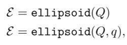

# Chapter2. Set Representations and Operations


- [Chapter2. Set Representations and Operations](#chapter2-set-representations-and-operations)
  - [2.1 Set Operations](#21-set-operations)
    - [2.1.1 Basic Set Operations](#211-basic-set-operations)
      - [2.1.1.1 mtimes](#2111-mtimes)
      - [2.1.1.2 plus](#2112-plus)
      - [2.1.1.3 cartProd](#2113-cartprod)
      - [2.1.1.4 convHull](#2114-convhull)
      - [2.1.1.5 quadMap](#2115-quadmap)
      - [2.1.1.6 and](#2116-and)
      - [2.1.1.7 or](#2117-or)
    - [2.1.2 Predicates](#212-predicates)
      - [2.1.2.1 in](#2121-in)
      - [2.1.2.2 isIntersecting](#2122-isintersecting)
      - [2.1.2.3 isFullDim](#2123-isfulldim)
      - [2.1.2.4 isequal](#2124-isequal)
      - [2.1.2.5 isempty](#2125-isempty)
    - [2.1.3 Set Properties](#213-set-properties)
      - [2.1.3.1 center](#2131-center)
      - [2.1.3.2 dim](#2132-dim)
      - [2.1.3.3 norm](#2133-norm)
      - [2.1.3.4 vertices](#2134-vertices)
      - [2.1.3.5 volume](#2135-volume)
    - [2.1.4 Auxiliary Operations](#214-auxiliary-operations)
      - [2.1.4.1 cubMap](#2141-cubmap)
      - [2.1.4.2 enclose](#2142-enclose)
      - [2.1.4.3 enclosePoints](#2143-enclosepoints)
      - [2.1.4.4 generateRandom](#2144-generaterandom)
      - [2.1.4.5 randPoint](#2145-randpoint)
      - [2.1.4.6 reduce](#2146-reduce)
      - [2.1.4.7 supportFunc](#2147-supportfunc)
      - [2.1.4.8 plot](#2148-plot)
      - [2.1.4.9 project](#2149-project)
  - [2.2 Set Representations](#22-set-representations)
    - [2.2.1 Basic Set Representations](#221-basic-set-representations)
      - [2.2.1.1 Zonotopes](#2211-zonotopes)
          - [1.n维空间上的zonotope定义](#1n维空间上的zonotope定义)
          - [2.CORA中zonotope的声明方式](#2cora中zonotope的声明方式)
          - [3.代码示例](#3代码示例)
          - [4.zonotope的产生过程](#4zonotope的产生过程)
      - [2.2.1.2 Intervals（区间）](#2212-intervals区间)
          - [1.n维空间上的interval定义](#1n维空间上的interval定义)
          - [2.CORA中interval的声明方式](#2cora中interval的声明方式)
          - [示例](#示例)
      - [2.2.1.3 Ellipsoids（椭圆体）](#2213-ellipsoids椭圆体)
          - [1.nxn空间上Ellipsoids的定义](#1nxn空间上ellipsoids的定义)
          - [2.CORA中ellipsoids的声明方式](#2cora中ellipsoids的声明方式)
          - [3.示例](#3示例)
      - [2.2.1.4 MPT Polytopes（MPT多面体）](#2214-mpt-polytopesmpt多面体)
      - [2.2.1.5 Polynomial Zonotopes（多项的zonotope)](#2215-polynomial-zonotopes多项的zonotope)
      - [2.2.1.6 Capsules（胶囊）](#2216-capsules胶囊)
      - [2.2.1.7 Zonotope Bundles (zonotope束)](#2217-zonotope-bundles-zonotope束)
      - [2.2.1.8 Constrained Zonotopes](#2218-constrained-zonotopes)
      - [2.2.1.9 Probabilistic Zonotopes](#2219-probabilistic-zonotopes)
    - [2.2.2 Auxiliary Set Representations](#222-auxiliary-set-representations)
      - [2.2.2.1 Constrained Hyperplane](#2221-constrained-hyperplane)
      - [2.2.2.2 Halfspace](#2222-halfspace)
      - [2.2.2.3 Level Sets](#2223-level-sets)
    - [2.2.3 Set Representations for Range Bounding](#223-set-representations-for-range-bounding)
      - [2.2.3.1 Taylor Models](#2231-taylor-models)
      - [2.2.3.2 Affine](#2232-affine)
      - [2.2.3.3 Zoo](#2233-zoo)


## 2.1 Set Operations

### 2.1.1 Basic Set Operations

#### 2.1.1.1 mtimes


#### 2.1.1.2 plus


#### 2.1.1.3 cartProd


#### 2.1.1.4 convHull


#### 2.1.1.5 quadMap


#### 2.1.1.6 and


#### 2.1.1.7 or


### 2.1.2 Predicates

#### 2.1.2.1 in


#### 2.1.2.2 isIntersecting


#### 2.1.2.3 isFullDim


#### 2.1.2.4 isequal


#### 2.1.2.5 isempty


### 2.1.3 Set Properties

#### 2.1.3.1 center


#### 2.1.3.2 dim


#### 2.1.3.3 norm


#### 2.1.3.4 vertices


#### 2.1.3.5 volume


### 2.1.4 Auxiliary Operations

#### 2.1.4.1 cubMap


#### 2.1.4.2 enclose


#### 2.1.4.3 enclosePoints


#### 2.1.4.4 generateRandom


#### 2.1.4.5 randPoint


#### 2.1.4.6 reduce


#### 2.1.4.7 supportFunc


#### 2.1.4.8 plot


#### 2.1.4.9 project


## 2.2 Set Representations

> 可达性分析对集合表示的要求：
>
> - 足以能够精准得描述可达性集合
> - 需要能够保证运行效率和可伸缩性


CORA支持内部某些集合表示之间进行相互转化，只需要将一个集合的实例交给另一个集合的构造器即可。下图为不同集合表示方法之间进行相互转换的关系。

> o: over-approximatation(超精度转换)
>
> e: exact conversion(精准转换)


集合表示转换示例

```matlab
% 创建 zonotope 对象
zono = zonotope([1 2 1;0 1 -1]);

% 转换为其他的集合表示
% 转换为interval(o)
int = interval(zono);
% 转换为polytope(e)
poly = mptPolytope(zono);
```


### 2.2.1 Basic Set Representations

#### 2.2.1.1 Zonotopes

> zonotope是一种紧凑的(compact)，用于表示高维空间中的集合。实际上，zonotope可以被看做数个线段的闵可夫斯基加和。
>
> tips：实际上，zonotope可以看作为数个变量的可能取值，通过一个中心点+数个噪声变量的形式表示


###### 1.n维空间上的zonotope定义


> c：中心点
>
> g<sup>(i)</sup>：generator(发生器)


###### 2.CORA中zonotope的声明方式


> G = [g(1),g(2),......g(p)]


###### 3.代码示例

```matlab
% construct zonotope 
c = [1;1]; 
G = [1 1 1; 1 -1 0];
zono = zonotope(c,G);
```


###### 4.zonotope的产生过程

> 以3中的定义为例：
>
> 1. 以c点作为中心点
> 2. 向(1,1),(-1,-1)两个方向进行一次移动，得到一条线段
> 3. 线段上的所有点向(1,-1),(-1,1)两个方向进行一次移动，得到一个正方形
> 4. 正方形上的所有点向(1,0),(-1,0)两个方向进行一次移动，得到一个六边形


#### 2.2.1.2 Intervals（区间）

> interval(区间)，是一个n维空间上的连通子集，使用上下界来进行定义


###### 1.n维空间上的interval定义


###### 2.CORA中interval的声明方式


> 注意，上下界均可以不止一个，以便表示不同维度中的interval


###### 示例

```matlab
% construct interval 
% 注意，-2~4为一组，-1~3为一组
lb = [-2; -1];
ub = [4; 3];
int = interval(lb,ub);
```


#### 2.2.1.3 Ellipsoids（椭圆体）

> 椭圆体是一个R<sup>n</sup>维度上的几何学对象，由一个中心q和一个正的、半正定的对称矩阵定义


###### 1.nxn空间上Ellipsoids的定义


> 上述两种定义方式等价


###### 2.CORA中ellipsoids的声明方式



###### 3.示例

```matlab
% construct 
ellipsoid Q = [13 7; 7 5]; 
q = [1; 2];
E = ellipsoid(Q,q);
```


#### 2.2.1.4 MPT Polytopes（MPT多面体）


#### 2.2.1.5 Polynomial Zonotopes（多项的zonotope)


#### 2.2.1.6 Capsules（胶囊）


#### 2.2.1.7 Zonotope Bundles (zonotope束)


#### 2.2.1.8 Constrained Zonotopes


#### 2.2.1.9 Probabilistic Zonotopes


### 2.2.2 Auxiliary Set Representations

#### 2.2.2.1 Constrained Hyperplane

#### 2.2.2.2 Halfspace

#### 2.2.2.3 Level Sets

### 2.2.3 Set Representations for Range Bounding

#### 2.2.3.1 Taylor Models

#### 2.2.3.2 Affine

#### 2.2.3.3 Zoo