# Chapter 3 Matrix Set Representations and Operations

- [Chapter 3 Matrix Set Representations and Operations](#chapter-3-matrix-set-representations-and-operations)
  - [3.1 Matrix Set Operations](#31-matrix-set-operations)
    - [3.1.1 mtimes](#311-mtimes)
    - [3.1.2 plus](#312-plus)
    - [3.1.3 expm](#313-expm)
    - [3.1.4 vertices](#314-vertices)
  - [3.2 Matrix Set Representations](#32-matrix-set-representations)
    - [3.2.1 Matrix Polytopes](#321-matrix-polytopes)
    - [3.2.2 Matrix Zonotopes](#322-matrix-zonotopes)
    - [3.2.3 Interval Matrices](#323-interval-matrices)


> 在之前的章节中，介绍的主要是向量形式的集合，然而，矩阵形式的集合也有着很重要的作用。例如一个有着不确定参数的线性系统，就需要这样的表示方法。
>
> CORA支持了三种矩阵集合的表示：
>
> - Matrix polytope 
> - Matrix zonotope 
> - Interval matrix 
>
> 对于上述三种矩阵集合的表示，其互相的转换操作在CORA中也进行了实现，使用的是over-approximative或exact conversino的方式
>
> ```matlab
> % interval matrix 
> C = [0 1;0 -2.5]; 
> D = [0 0;0 0.5]; 
> intMat = intervalMatrix(C,D);
> 
> % conversion to other matrix set representations matZono = matZonotope(intMat);
> matPoly = matPolytope(intMat);
> ```
>
> 转换时采取的方式如下所示：
>
> 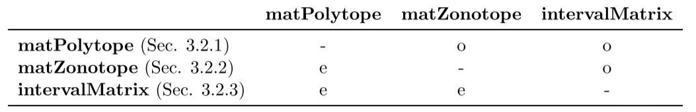


## 3.1 Matrix Set Operations 

### 3.1.1 mtimes

> mtimes方法重载了”*“运算符，实现了对两个矩阵集合/一个矩阵集合和一个 向量集合的乘法操作


##### 1.定义

给定R<sup>nxn</sup>上的两个矩阵集合A1和A2，以及一个向量集合S，mtimes操作的定义如下

```
mtimes(A1,A2) = A1 ⊗A2 = {A1 · A2 | A1 ∈ A1, A2 ∈ A2} mtimes(A1, S) = A1 ⊗ S = {A1 · s | A1 ∈ A1, s ∈ S}.
```


##### 2.示例

```matlab
% vector set 
S = zonotope([0 1 1 0; ... 0 1 0 1]);

% matrix set 
C = [1 0; -1 0.5]; 
D = [0.1 0; 0 0.2]; 
A = intervalMatrix(C,D);

% linear transformation
res = A * S;
```

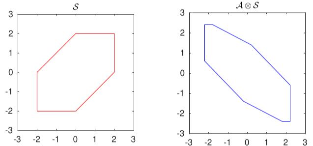


### 3.1.2 plus

> plus操作重载了”+“运算符，实现了两个矩阵集合的**闵可夫斯基和**


##### 1.定义

给定R<sup>nxn</sup>上的两个矩阵集合A1和A2，plus操作的定义如下

```
plus(A1,A2) = A1 ⊕A2 = {A1 +A2 | A1 ∈ A1, A2 ∈ A2}
```


##### 2.示例

```matlab
% matrix sets 
A1 = intervalMatrix([0 1;2 3],[1 2;0 1]); 
A2 = intervalMatrix([3 2;2 2],[0 1;1 0]);

% Minkowski addition
res = A1 + A2
```

结果：

res = 

[2.000,4.000] [0.000,6.000]
[3.000,5.000] [4.000,6.000]


### 3.1.3 expm

##### 1.定义

给定一个矩阵集合A ⊂  R<sup>n×n</sup>，expm方法实现对其矩阵指数(matrix exponential)的enclosure计算

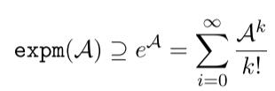

用于计算矩阵指数的参数η也可以传入expm方法

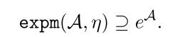

> tips:
>
> 矩阵集合的矩阵指数的tight enclosure对于线性参数系统的可达性分析有着重要意义


##### 2.示例

```matlab
% matrix set 
C = [0 1;0 -2.5]; 
D = [0 0;0 0.5]; 
A = intervalMatrix(C,D);

% matrix exponential
eA = expm(A)
```


### 3.1.4 vertices

##### 1.定义

给定一个矩阵集合A ⊂ R<sup>n×n</sup>,vertices方法会计算它的所有顶点V1, . . . , Vq, Vi ∈ R<sup>n×n</sup>

```
%vertList是MATLAB中的cell array，存储所有的顶点Vi
vertList = vertices(A)
```


##### 2.示例

```matlab
% matrix set 
C = [0 1;3 2]; G{1} = [1 2;0 1];
A = matZonotope(C,G);

% compute vertices
res = vertices(A)
```

结果：

res{1} =

-1.0000 -1.0000 

3.0000 1.0000
res{2} = 

1.0000 3.0000
3.0000 3.0000


## 3.2 Matrix Set Representations 

> 此部分介绍了CORA中提供的矩阵集合


### 3.2.1 Matrix Polytopes 

##### 1.定义

矩阵1的polytope定义和向量的polytope定义类似(Chap2  2.2.1.4 MPT Polytope)

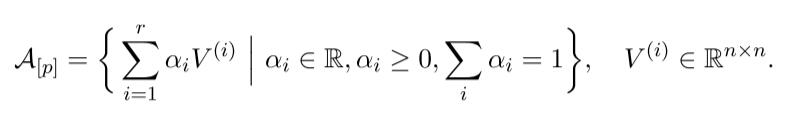

> 图中的V<sup>i</sup>也被称为Matrix Polytope的顶点，如果将V<sup>i</sup>替换为向量，就变成了V-polytope的表示法


在CORA中，使用matPolytope类实现了Matrix Polytope，使用方式如下

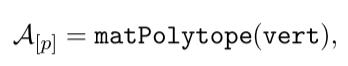

> vert：MATLAB中的cell array，存储顶点V<sup>i</sup>


##### 2.示例

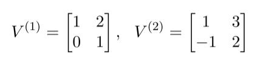

```matlab
% vertices 
V{1} = [1 2; 0 1]; 
V{2} = [1 3; -1 2];

% matrix polytope
mp = matPolytope(V);
```


### 3.2.2 Matrix Zonotopes 

##### 1.定义

> 类似的，矩阵Zonotope和向量Zonotope的定义也是相似的

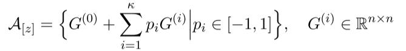

> 上述定义的简写为A<sub>[z]</sub> = (G(0), G(1), . . . , G(κ))。其中，第一个矩阵G(0)代表Zonotope的中心矩阵，剩余的为generator matrices。Matrix Zonotope的阶数被定义为ρ = κ/n
>
> tips:如果将generator替换为向量，则获得的是普通的Zonotope


CORA中，使用matZonotope类实现Matrix Zonotope，其使用方式如下

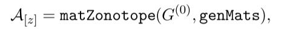

> genMat是MATLAB中的cell array，存储所有的generator matrices


##### 2.示例

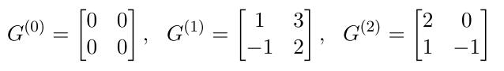

```matlab
% matrix center 
C = [0 0; 0 0];

% matrix generators 
G{1} = [1 3; -1 2];
G{2} = [2 0; 1 -1];

% matrix zonotope 
mz = matZonotope(C,G);
```


### 3.2.3 Interval Matrices

##### 1.定义 

interval Matrix是一种特殊的Matrix Zonotope，它限制了每个矩阵元素的取值范围

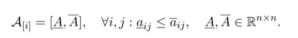

> $\underline{A}$：矩阵元素的下界
>
> $\overline{A}$：矩阵元素的上界


CORA中，使用intervalMatrix类来实现区间矩阵

**A<sub>[i]</sub> = intervalMatrix(C,D)**

> C：C=0.5($\underline{A}+\overline{A}$)，为中心矩阵
>
> D：D=0.5($\overline{A}-\underline{A}$)，为宽度矩阵


##### 2.示例

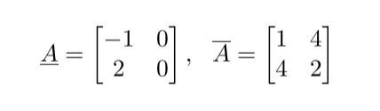

```matlab
% center matrix 
C = [0 2; 3 1];

% width matrix 
D = [1 2; 1 1];

% interval matrix 
mi = intervalMatrix(C,D);
```

