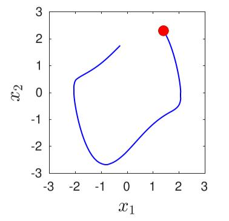
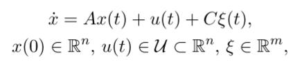

# Chapter 4 Dynamic Systems and Operations

- [Chapter 4 Dynamic Systems and Operations](#chapter-4-dynamic-systems-and-operations)
  - [4.1 Dynamic System Operations](#41-dynamic-system-operations)
    - [4.1.1 reach](#411-reach)
    - [4.1.2 simulate](#412-simulate)
    - [4.1.3 simulateRandom](#413-simulaterandom)
    - [4.1.4 simulateRRT](#414-simulaterrt)
    - [4.1.5 cora2spaceex](#415-cora2spaceex)
  - [4.2 Continuous Dynamics](#42-continuous-dynamics)
    - [4.2.1 Linear Systems](#421-linear-systems)
      - [4.2.1.1 Operation reach](#4211-operation-reach)
    - [4.2.2 Linear Systems with Uncertain Parameters](#422-linear-systems-with-uncertain-parameters)
      - [4.2.2.1 Operation reach](#4221-operation-reach)
    - [4.2.3 Linear Discrete-Time Systems](#423-linear-discrete-time-systems)
      - [4.2.3.1 Operation reach](#4231-operation-reach)
    - [4.2.4 Linear Probabilistic Systems](#424-linear-probabilistic-systems)
      - [4.2.4.1 Operation reach](#4241-operation-reach)
    - [4.2.5 Nonlinear Systems](#425-nonlinear-systems)
      - [4.2.5.1 Operation reach](#4251-operation-reach)
    - [4.2.6 Nonlinear Systems with Uncertain Parameters](#426-nonlinear-systems-with-uncertain-parameters)
      - [4.2.6.1 Operation reach](#4261-operation-reach)
    - [4.2.7 Nonlinear Discrete-Time Systems](#427-nonlinear-discrete-time-systems)
      - [4.2.7.1 Operation reach](#4271-operation-reach)
    - [4.2.8 Nonlinear Differential-Algebraic Systems](#428-nonlinear-differential-algebraic-systems)
      - [4.2.8.1 Operation reach](#4281-operation-reach)
  - [4.3 Hybrid Dynamics](#43-hybrid-dynamics)
    - [4.3.1 Hybrid Automata](#431-hybrid-automata)
      - [4.3.1.1 Operation reach](#4311-operation-reach)
    - [4.3.2 Parallel Hybrid Automata](#432-parallel-hybrid-automata)
      - [4.3.2.1 Operation reach](#4321-operation-reach)

> 本章中介绍了动态系统和其对应的操作


## 4.1 Dynamic System Operations

> 为了提高CORA的可用性，所有的动态系统都支持一系列操作，例如计算可达集合的"reach"操作。本章节(4.1)中介绍的时目前实现的常用操作。


### 4.1.1 reach

> reach操作计算一个动态系统的可达集合


##### 1.定义

动态系统的解(solution)记作：χ(t; x0, u(·), p)

> t：t∈R ，代表时间
>
> x<sub>0</sub>： x<sub>0</sub> = x(t<sub>0</sub>) ∈ R<sup>n</sup>，代表初始状态
>
> u(.)：u(.)∈R<sup>m</sup>，代表系统输入
>
> p：p∈R<sup>p</sup>，代表参数向量

t = t<sub>f</sub>时刻的可达集合可以使用上述的三个参数定义(除了t以外的另外三个参数)


由于精确的R<sup>e</sup>难以计算，因此往往采用近似计算，结算R<sup>e</sup>的tight enclosure R<sup>t</sup>,满足不等关系：R(t) ⊇ R<sup>e</sup>(t).


CORA中reach操作的语法如下：

```
R = reach(sys, params, options) 
[R, res] = reach(sys, params, options, spec)
```

> ###### 输入参数
>
> sys：在4.2/4.3中介绍的任意一种动态系统，如"linearSys"
>
> params：包含定义可达性问题所有参数的结构
>
> - .tStart：起始时间t<sub>0</sub>，默认值为0
> - .tFinal：最终时间t<sub>f</sub>
> - .R0：在2.2.1中介绍的任意一种集合表示的起始集合
> - .U：输入集合U，以Zonotope类的实例形式传入
> - .u：输入集合U(t) := uc(t)⊕U基于时间的中心u<sub>c</sub>(t)。以矩阵的形式体现，其列的值与可达性分析的步骤相同(可选项)
> - .paramInt：参数值集合P，形式为interval类
> - .y0guess：一致输入代数状态(a consistent initial algebraic state)的猜测，仅nonlinDASys类需要
> - .startLoc：初始位置的index(仅hybridAutomaton类和 parallelHybridAutomaton类需要)
> - .finalLoc：最终位置的index。当到达最终位置时，可达性分析立即停止(仅hybridAutomaton类和 parallelHybridAutomaton类需要))
>
> options：包含用于可达性分析算法的相关设置的结构，每个算法的对应设置不同，因此在4.2和4.3中进行介绍
>
> spec：specfication类(Sec6.3中介绍)的实例，代表系统需要验证的内容。如果验证结果为规格被违反，则可达性分析立刻停止
>
> 
>
> ###### 输出参数
>
> R：reachSet类的实例，存储t<sub>i</sub>时刻的可达集合R(t<sub>i</sub>)和T<sub>i</sub>区间的可达集合R(<sub>Ti</sub>)   （T<sub>i</sub> = [t<sub>i</sub>,t<sub>i+1</sub>])
>
> res：布尔型的flag，表明规格(specification)是否被满足，满足时res==1，否则为0


##### 2.示例

```matlab
% system dynamics 
sys = linearSys([-0.7 -2;2 -0.7],[1;1],[-2;-1]);

% parameter 
params.tFinal = 5; 
params.R0 = zonotope(interval([2;2],[2.5;2.5])); 
params.U = zonotope(interval(-0.1,0.1));

% reachability settings 
options.timeStep = 0.05; 
options.zonotopeOrder = 10; 
options.taylorTerms = 5;

% reachability analysis
R = reach(sys,params,options)
```


### 4.1.2 simulate

##### 1.定义

simulate操作模拟一个动态系统，根据初始状态x<sub>0</sub>、输入u(t)、参数p，计算轨迹。


在CORA中的simulate语法如下

```
[t, x] = simulate(sys, params) 
[t, x, ind] = simulate(sys, params, options)
```

> ###### 输入参数
>
> sys：在4.2/4.3中介绍的任意一种动态系统，如"linearSys"
>
> params：包含定义可达性问题所有参数的结构
>
> - .tStart：起始时间t<sub>0</sub>，默认值为0
>
> - .tFinal：最终时间t<sub>f</sub>
>
> - .x0：起始点x<sub>0</sub>
>
> - .u：以矩阵形式展示的分段常数输入信号u(t)，矩阵的行于系统的输入一致
>
>   e.g. 第一行：x x x x x x x
>
>   ​		第二行：x x x x x x x
>
> - .p：参数值p(仅nonlinParamSys类需要)
>
> - .y0guess：一致输入代数状态(a consistent initial algebraic state)的猜测，仅nonlinDASys类需要
>
> - .startLoc：初始位置的index(仅hybridAutomaton类和 parallelHybridAutomaton类需要)
>
> - .finalLoc：最终位置的index。当到达最终位置时，可达性分析立即停止(仅hybridAutomaton类和 parallelHybridAutomaton类需要))
>
> options：MATLAB的ode45方法需要的模拟选项
>
> 
>
> ###### 输出参数
>
> t：模拟轨迹的时间点(timep point)
>
> x：模拟轨迹的状态
>
> ind：MATLAB的ode45方法触发的事件方法的index


##### 2.示例

```matlab
% nonlinear system 
f = @(x,u) [x(2) + u; ... (1-x(1)ˆ2)*x(2)-x(1)];
sys = nonlinearSys(f);

% parameter 
params.x0 = [1.4;2.3]; 
params.tFinal = 6; 
params.u = [0.1 0 -0.1 0.2];

% simulation
[t,x] = simulate(sys,params);
```




### 4.1.3 simulateRandom

##### 1.定义

simulateRandom操作模拟一个初始状态、输入值、参数均有多个的动态系统

(x<sub>0</sub>∈X<sub>0</sub>;u(t)∈U;p∈P)


在CORA中的simulateRandom语法如下

```
simRes = simulateRandom(sys, params, options)
```

> ###### 输入参数
>
> sys：在4.2/4.3中介绍的任意一种动态系统，如"linearSys"
>
> params：simulateRandom的param参数和reach操作的param参数一致
>
> options：包含随机模拟的设置的结构
>
> - .points：随机初始状态的个数(需要是正整数)
> - .fracVert：从初始状态集合X<sub>0</sub>的顶点中随机提取的初始状态的比例，需要是一个[0,1]之间的值
> - .fracInpVert：从输入集合U的顶点中随机提取的初始状态的比例，需要是一个[0,1]之间的值
> - .inpChanges：模拟过程中改变的输入信号的数量，需要是一个非负整数
>
> 
>
> ###### 输出参数
>
> simRes：simResult类(Sec6.2中介绍)的实例，存储模拟得到的所有轨迹。


##### 2.示例

```matlab
% system dynamics 
sys = linearSys([-0.7 -2;2 -0.7],[1;1],[-2;-1]);

% parameter 
params.tFinal = 5; 
params.R0 = zonotope(interval([2;2],[2.5;2.5]));
params.U = zonotope(interval(-0.1,0.1));

% simulation settings 
options.points = 7; 
options.fracVert = 0.5; 
options.fracInpVert = 1; options.inpChanges = 10;

% random simulation
simRes = simulateRandom(sys,params,options);
```


### 4.1.4 simulateRRT

RRT：rapidly exploring random trees，快速探索随机数，一种路径规划算法


##### 1.定义

simulateRTT操作使用RTT算法模拟动态系统，这样做的目的是确定初始状态、输入和参数，从而能够获得尽可能好的轨迹


在CORA中，simulateRTT的语法如下：

```
simRes = simulateRRT(sys, R, params, options)
```

> ###### 输入参数
>
> sys：在4.2/4.3中介绍的任意一种动态系统，如"linearSys"
>
> R：reachSet类(Sec6.1中介绍)的实例，保存可达性问题的所有可达集合
>
> params：包含定义可达性问题的参数的结构。此参数与reach操作的对应参数一致
>
> options：包含随机模拟设置的结构
>
> - .points：随机初始状态的数量(正整数)
> - .vertSamp：表明初始状态、输入、参数是否从对应的集合中采样的flag(其值为0或1)
> - .strechFac：在算法执行时对可达集合进行膨胀的拉伸系数(取值范围为>1)
>
> 
>
> ###### 输出参数
>
> simRes：simResult类的实例，存储所有的模拟得到的轨迹


##### 2.示例

```matlab
% system dynamics 
sys = linearSys([-0.7 -2;2 -0.7],[1;1],[-2;-1]);

% parameter 
params.tFinal = 5; 
params.R0 = zonotope(interval([2;2],[2.5;2.5])); 
params.U = zonotope(interval(-0.1,0.1));

% reachability settings 
options.timeStep = 0.05; 
options.zonotopeOrder = 10; 
options.taylorTerms = 5;

% reachability analysis 
R = reach(sys,params,options);

% simulation settings 
simOptions.points = 20; 
simOptions.vertSamp = 0; simOptions.strechFac = 1.5;

% simulation with RRTs
simRes = simulateRRT(sys,R,params,simOptions);
```


### 4.1.5 cora2spaceex

将CORA对象转换为SpaceEx模型的方法，介绍略


## 4.2 Continuous Dynamics

这一部分介绍不同的用于表示连续动态系统(continuous dynamics)的类


CORA中使用下述8个类支持了连续动态系统的表示：

- Linear systems 
- Linear systems with uncertain parameters
- Linear discrete-time systems 
- Linear probabilistic systems
- Nonlinear systems
- Nonlinear systems with uncertain parameters 
- Nonlinear discrete-time systems 
- Nonlinear differential-algebraic systems 

上述的每个类都继承了父类contDynamics


### 4.2.1 Linear Systems

最简单的线性系统的形式如下


> x(t)∈R<sup>n</sup>,代表系统的状态
>
> u(t)∈R<sup>m</sup>，代表系统的输入
>
> y(t)∈R<sup>p</sup>，代表系统的输出
>
> (下面的A到k，均为系数)
>
> A∈R<sup>nxn</sup>
>
> B∈R<sup>nxm</sup>
>
> c∈R<sup>n</sup>
>
> C∈R<sup>pxn</sup>
>
> D∈R<sup>pxm</sup>
>
> k∈R<sup>p</sup>


CORA中，使用linearSys类实现了线性系统

```
sys = linearSys(A, B) 
sys = linearSys(A, B, c, C,D, k) 
sys = linearSys(name, A, B)
sys = linearSys(name, A, B, c, C,D, k)
```

> name：线性系统实例的名称，可选项


##### 示例

```matlab
% system matrices 
A = [-2 0; 1 -3]; 
B = [1; 1]; C = [1 0];

% linear system
sys = linearSys(A,B,[],C);
```


#### 4.2.1.1 Operation reach

在CORA中，实现了多个计算线性系统可达集合的算法。


作者推荐使用适应性算法(the adaptive algorithm)，因为这个算法不需要使用者输入任何参数进行调整。


线性系统的可达集合计算的过程为：

1. 通过将初始集合X<sub>0</sub>以及矩阵指数e<sup>A∆t</sup>进行传递，计算出下一时间点的可达集合R<sup>d</sup> <sub>h</sub> = e<sup>A∆t</sup>X0
2. 计算凸包(convex hull)
3. 根据凸包，使用一项误差项进行膨胀，以解释轨迹的曲率，从而得到T<sub>0</sub>时间区间内的可达集合的一个较精确的结果(a tight enclosure)


对于线性系统可达性分析的设置可以通过Option结构的以下几项来实现

- .linAlg：指定使用哪种可达性算法，默认值是"standard"

- .timeStep：时间步长，除了"adpt"外的其余所有算法都需要指定此项

- .taylorTerms：矩阵指数e<sup>A∆t</sup>的计算中，泰勒项的个数，除了"adpt"外的其余所有算法都需要指定此项

- .zonotopeOrder：zonotope阶数$\rho$的上界，除了"adpt"外的其余所有算法都需要指定此项

- .reductionTechnique：指定减小zonotope阶数$\rho$的方法的项，默认值为"girard"

- .partition：指定每个block覆盖的维度范围的参数数组(所有的block组合成为线性系统)，仅算法"decomp"需要

- .krylovError：Krylov算法错误的上界，仅当选择算法"krylov"时需要

- .krylovStep：Krylov算法中，在错误比上界低时，用于增加Krylov子空间ξ 的步长，仅当选择算法"krylov"时需要

- .error：超精度项(over-approximative terms)中的错误的上界,仅算法"adpt

  "需要。默认值为初始集合的区间超精度估计的最长边的1/100


### 4.2.2 Linear Systems with Uncertain Parameters 

此类继承了线性系统类，并增添了不确定参数的表示。此类有两种不同的实现，一种实现支持固定的不确定参数；另一种实现可以随着时间任意变化的不确定参数。

##### 1.固定参数的线性参数系统定义为(**1,2两种表示方式等价**)：

（1）


（2）


> x(t)∈R<sup>n</sup>,代表系统的状态
>
> u(t)∈R<sup>m</sup>，代表系统的输入
>
> p∈R<sup>p</sup>，为参数向量
>
> P(大写)  ⊂ R<sup>p</sup>，参数的集合


##### 2.参数变化的线性参数系统定义如下


> t为时间，会不断变化


CORA中，使用linParamSys类实现了线性系统

```
sys = linParamSys(A, B) 
sys = linParamSys(A, B, type) 
sys = linParamSys(name,A, B)
sys = linParamSys(name,A, B, type)
```

> name：系统的名称
>
> A,B：在上文中已写出了定义，注意A,B这两个矩阵集合可以使用Sec3中介绍的任意一种矩阵集合表示
>
> type：表明参数是否随时间变化
>
> - constParam：不随时间变化，默认值
> - varParam：随时间变化


##### 实例

```matlab
% system matrices 
Ac = [-2 0; 1.5 -3]; 
Aw = [0 0; 0.5 0]; 
A = intervalMatrix(Ac,Aw);

B = [1; 1];

% linear parametric system
sys = linParamSys(A,B,’varParam’);
```


#### 4.2.2.1 Operation reach

线性参数系统的可达性分析和已知参数的线性系统是很相似的，其主要的区别为是否需要考虑不确定的状态矩阵A和不确定的输入矩阵B。


对于参数不确定的线性系统可达性分析的设置可以通过Option结构的以下几项来实现：

- .timeStep：时间步长，除了"adpt"外的其余所有算法都需要指定此项
- .taylorTerms：矩阵指数e<sup>A∆t</sup>的计算中，泰勒项的个数，除了"adpt"外的其余所有算法都需要指定此项
- .zonotopeOrder：zonotope阶数$\rho$的上界，除了"adpt"外的其余所有算法都需要指定此项
- .reductionTechnique：指定减小zonotope阶数$\rho$的方法的项，默认值为"girard"
- .intermediateOrder：此算法的internal计算部分，zonotope阶数$\rho$的上界
- .compTimePoint：指出可达集合是否需要被在时间点上计算的flag


### 4.2.3 Linear Discrete-Time Systems

除了连续时间的线性系统，CORA同样也支持离散时间的线性系统，其定义如下


> x[t]∈R<sup>n</sup>，代表系统的状态
>
> u[t]∈R<sup>m</sup>，代表系统的输入
>
> y[t]∈R<sup>p</sup>，代表系统的输出
>
> A∈R<sup>nxn</sup>，B∈R<sup>nxm</sup>，c∈R<sup>n</sup>
>
> C∈R<sup>pxn</sup>，D∈R<sup>pxm</sup>，k∈R<sup>p</sup>
>


在CORA中，线性离散时间系统使用linearSysDT类实现，其构造方式可以是如下几种

```
sys = linearSysDT(A, B,∆t) 
sys = linearSysDT(A, B, c, C,D, k,∆t) 
sys = linearSysDT(name, A, B,∆t)
sys = linearSysDT(name, A, B, c, C,D, k,∆t)
```

> name：系统的名称
>
> Δt：采样时间间隔，即 x[i + 1] 与 x[i] 之间间隔的时间


##### 示例

```matlab
% system matrices 
A = [-0.4 0.6; 0.6 -0.4]; 
B = [0; 1];
C = [1 0];

% sampling time 
dt = 0.4;

% linear discrete-time system
sys = linearSysDT(A,B,[],C,dt);
```


#### 4.2.3.1 Operation reach

线性离散时间系统的可达集合，可以通过基于集合的评估来计算。随着time step的迭代，zonotope的阶数会逐渐减小到理想值。

对于线性离散时间的可达性分析可以通过Option结构的以下几项设置来实现

- .zonotopeOrder：zonotope阶数ρ的上界
- .reductionTechnique：指定减小zonotope阶数$\rho$的方法的项，默认值为"girard"


### 4.2.4 Linear Probabilistic Systems

 与其他所有的系统不同，线性概率系统考虑随机的属性。此系统使用线性随机微分等式(Stochastic Differential Equation SDE)定义，也可称为多元Ornstein-Uhlenbeck过程



> A、C：系数矩阵，且A需要是满秩矩阵(能够保证方程有唯一解)
>
> 输入
>
> - u：第一项输入，满足李普希兹连续，且其取值范围在U中，没有概率分布
>
> - ξ：第二项输入，ξ∈R<sup>m</sup>，白高斯噪音
>
> 两项输入联合起来，可以视为一个白高斯噪音输入，其均值在集合U中，但是是未知的.


与其他表示系统的类不同，linProbSys类计算的是封闭的概率壳(Enclosing Probabilistic Hull EPH) ，即在部分参数不确定且没有概率分布时，一个能够包括所有可能概率分布的hull


- linProbSys类使用的概率密度函数为：f<sub>X</sub>(x, r)，其含义为：”针对在时间t = r时，一个指定轨迹u(t)∈U的随机过程X(t)的概率密度函数“。
- 所有可能的概率密度函数的EPH记作：$\overline{f}_X(x,r)$，其定义为：”{f<sub>X</sub>(x, r)|X(t)为对于t∈[0,r]时间区间内的一个解，u(t) ∈ U, f<sub>X</sub>(x, 0) = f0}“
- [0,r]时间区间内的EPH定义为$\overline{f}_X(x,[0,r])$= sup{ $\overline{f}_X(x,t)$|t ∈ [0, r]}.

> 本部分的原文较复杂，列出如下：
>
> 


##### 示例

```matlab
% system matrices 
A = [-1 -4; 4 -1]; 
B = eye(2); 
C = 0.7*eye(2);

% linear system
sys = linProbSys(’twoDimSys’,A,B,C);
```


#### 4.2.4.1 Operation reach

对于线性概率系统的可达性分析与没有随机不确定性参数的线性系统类似，但区别是，本系统中，时间间隔的解必须由此前提到过的EPH封闭。


Option部分提供的设置如下所示

- .timeStep：时间步长，除了"adpt"外的其余所有算法都需要指定此项
- .taylorTerms：矩阵指数e<sup>A∆t</sup>的计算中，泰勒项的个数，除了"adpt"外的其余所有算法都需要指定此项
- .zonotopeOrder：zonotope阶数$\rho$的上界，除了"adpt"外的其余所有算法都需要指定此项
- .reductionTechnique：指定减小zonotope阶数$\rho$的方法的项，默认值为"girard"
- .gamma：指定正太分布置信集合大小的标量。在置信集合之外的概率不进行计算，而是加入”进入不安全集合“的概率值中


### 4.2.5 Nonlinear Systems

> 尽管线性系统可以表示很大一部分的动态系统，但是非线性系统仍然具有重要的意义，因为它是表示更加复杂系统的基础。


一般的非线性连续系统使用如下的微分方程表示：


> x(t),u(t)的意义同上
>
> f为一个R<sup>n</sup>xR<sup>m</sup> -->R<sup>n</sup>的映射，且满足全局李普希兹连续


在CORA中，非线性系统使用nonlinearSys类实现

```
sys = nonlinearSys(fun) 
sys = nonlinearSys(name, fun) 
sys = nonlinearSys(fun, n,m)
sys = nonlinearSys(name, fun, n,m),
```

> name：系统的名字
>
> fun：MATLAB中用于定义4.2.5中微分方程的方法
>
> n：状态的个数
>
> m：输入的个数
>
> tips：若n,m没有显式地给出，则由方法fun设置


##### 示例

```matlab
% differential equation f(x,u) 
f = @(x,u) [x(2) + u +(1-x(1)ˆ2)*x(2)-x(1)];

% nonlinear system
sys = nonlinearSys(f);
```


#### 4.2.5.1 Operation reach

对于非线性系统来说，可达性分析要更加复杂，因为在线性系统的相关计算中可以使用的很多有价值的特性不适用于非线性系统。

> e.g.叠加态原则
>
> 叠加态原则允许将均匀的解和不均匀的解分开计算

另一个线性系统的优势是，可达集合可以在没有不确定输入的情况下(有的话则不可行)使用线性映射进行计算，并且可以保证结果是封闭的。

> e.g. 
>
> 对于ellipsoids,zonotopes,polytopes等集合表示，可以先进行一次线性变化后进行计算，然后将计算结果再转为这些集合表示

在CORA中，非线性系统的可达性分析是基于状态空间抽象的。抽象的方式可以是：

- 线性系统(linear system)
- 多项式系统(polynomial system)

需要注意的是，由于进行抽象会增加误差，因此将抽象误差以over-approximately的方式进行估计，并以额外的不确定输入加入，从而保证计算过程的over-approximately


非线性系统可达集合的计算过程概览如下图所示

(可达集合在连续的时间间隔 t ∈ τk = [k r, (k + 1)r] where k ∈ N+中，迭代地进行计算)


==**计算过程的介绍如下：**==

1. 非线性系统$\dot{x}(t)$进行抽象的方式有两种

   - a.抽象为一个线性系统

   - b.将向量 z = [x<sup>T</sup>, u^T^]^T^ 引入到一个从k阶的泰勒级数的计算中得到的多项式系统中去

     

     其中，微分算符(Nabla Operator ,倒三角符号)的定义为

     

     e~i~∈R^n+m^，是一个正交的单位向量。

     抽象误差的集合L确保 f(x, u) ∈ f^abstract^(x, u) ⊕ L，从而保证能够以over-approximative计算可达集合

2. 随后，需要满足的抽象误差集合$\overline{L}$以启发式的方式被计算出来

3. 计算基于当前抽象结果的可达集合R^abstract^(tk)，需要满足$\dot{x}(t)$∈f^abstract^(x(t),u(t))⊕$\overline{L}$

4. 抽象错误L根据当前计算得到的可达集合R^abstract^(tk)进行计算

5. 判断是否满足L $\subseteq \overline{L}$，即判断误差是否可以接受。如果不满足，则说明需要对估计误差$\overline{L}$进行扩大。但如果多次扩大后，仍然无法满足要求，就需要进行可达集合的拆分。

6. 如果L $\subseteq \overline{L}$这一条件被满足，则抽象误差达到接受标准，随后使用L这一更严格的抽象误差进行可达集合的计算：$\dot{x}(t)$∈f^abstract^(x(t),u(t))⊕L

7. 下一步，就是进行下一轮的可达集合计算，以及去除重复的可达集合(能够被之前的可达集合覆盖的集合)，这一步的目的是减少下一步计算中需要被考虑的可达集合数量。


**其他相关内容**

- 在需要进行可达集合拆分时，工作区输出(workplace output)会使用关键词"spilt"进行标识
- 由于非线性系统的可达集合是非凸的(non-convex)，因此可以获得更好的enclosure效果
- 对于强非线性系统，作者推荐使用保守的多项式算法与多项Zonotopes结合的方法进行计算


**非线性系统的可达性算法**


Options部分提供的设置如下所示：

- .alg：决定使用的可达性算法的字段

- .timeStep：时间步长，除了"adpt"外的其余所有算法都需要指定此项

- .tensorOrder：用于进行抽象的泰勒展开式(nonlinearSys4.jpg)的阶数k，常用的值为2或3

- .taylorTerms：矩阵指数e<sup>A∆t</sup>的计算中，泰勒项的个数，除了"adpt"外的其余所有算法都需要指定此项

- .zonotopeOrder：zonotope阶数$\rho$的上界，除了"adpt"外的其余所有算法都需要指定此项

- .reductionTechnique：指定减小zonotope阶数$\rho$的方法的项，默认值为"girard"

- .errorOrder：在进行线性化误差(linearlization errors)之前，zonotope的阶数ρ的值需要被减少到errorOrder值。因为线性化误差的计算会使用到二次甚至三次的函数，从而显著提高generator的个数

- .intermediateOrder：此算法的internal计算部分，zonotope阶数$\rho$的上界

- .maxError：此参数是一个R^n^维度的向量，为可接受的抽象误差L设置了一个上界，如果L超出了上界，则需要进行可达集合的拆分。此参数的默认值为∞，即不对可达集合进行拆分

- .reductionInterval：为取消重复集合设置的time steps个数，超过此参数代表的值后，由于拆分集合造成的重复集合被取消

- .lagrangeRem：包含评估拉格朗日余项L的设置的结构

- polyZono：包含重新构建polyZono的设置的结构。==只有在选择'poly'作为可达性算法时==才需要设置

  

### 4.2.6 Nonlinear Systems with Uncertain Parameters

非线性的参数系统在非线性的基础上加入了未知参数的考量


> x(t),u(t)的意义同上，p∈R^p^，代表参数向量
>
> f：R^n^XR^m^XR^p^-->R^n^，并满足全局李普希兹连续这一条件
>
> 与有不确定参数的线性系统一样，不确定的参数p可以是一个常数向量，也可以随着时间不断变化


CORA中，使用nonlinearParamSys类实现有不确定参数的非线性系统

```
sys = nonlinParamSys(fun) 
sys = nonlinParamSys(fun, type) 
sys = nonlinParamSys(name, fun) 
sys = nonlinParamSys(name, fun, type) 
sys = nonlinParamSys(fun, n,m, p) 
sys = nonlinParamSys(fun, n,m, p, type) 
sys = nonlinParamSys(name, fun, n,m, p)
sys = nonlinParamSys(name, fun, n,m, p, type)
```

> name：系统名称
>
> fun：MATLAB中用于定义4.2.6中微分方程的方法
>
> n：状态的个数
>
> m：输入的个数
>
> p：参数的个数
>
> type：表明参数是否随时间变化
>
> - constParam：不随时间变化，默认值
> - varParam：随时间变化
>
> tips：与4.2.2类似，如果n,m,p未给出，则将由fun函数自动指定


##### 示例

```matlab
% differential equation f(x,u,p) 
f = @(x,u,p) [x(2) + u + p*(1-x(1)ˆ2)*x(2)-x(1)];

% nonlinear parametric system
sys = nonlinParamSys(f);
```


> 除了本部分(4.2.6)介绍的处理不确定的常数参数的方法外，还有一种选择是:
>
> - 对于常数不确定参数，将其作为一个状态变量$\tilde{x}_i$，且trivial dynamics $\dot{\tilde{x}}=0$
> - 对于随时间变化的不确定参数，将其作为不确定的输入
>
> 上述两种处理方法，均能达到使用非线性系统(Sec 4.2.5)计算含有不确定的参数情况的目的
>
> 但是，对于采用上述两种方法，还是采用4.2.6中介绍的带有不确定参数的非线性系统这一问题，目前尚无定论


#### 4.2.6.1 Operation reach

这一部分和4.2.5中的介绍几乎一致，唯一的不同是，对于使用保守的多项式算法(options.alg='poly')的情况，只能支持不确定参数是一个单点的情况，而不支持集合的情况。


### 4.2.7 Nonlinear Discrete-Time Systems

本部分中介绍的是非线性离散时间系统，定义如下

`x[i + 1] = f(x[i], u[i])`

> x[i]∈R^n^,代表系统状态
>
> u[i]∈R^m^，代表系统输入
>
> f：R^n^ X R^m^ $\to$  R^n^，是一个连续的函数


CORA中，使用nonlinearSysDT类实现非线性离散时间系统

```
sys = nonlinearSysDT(fun) 
sys = nonlinearSysDT(name, fun) 
sys = nonlinearSysDT(fun, n,m)
sys = nonlinearSysDT(name, fun, n,m)
```

> name：系统的名称
>
> fun：处理微分方程f(x[i],u[i])的MATLAB方法
>
> n,m与4.2.6中的意义一致


##### 示例

```matlab
% equation f(x,u) 
f = @(x,u) [x(1) + u(1); ... 
x(2) + u(2)*cos(x(1)); ... 
x(3) + u(2)*sin(x(1))];

% sampling time 
dt = 0.25;

% nonlinear discrete-time system
sys = nonlinearSysDT(f,dt);
```


#### 4.2.7.1 Operation reach

由于系统的发展是在离散之间中进行的，因此计算非线性离散系统的问题和计算非线性方程f(x[i], u[i])的image是一样的。

与连续时间上的非线性系统类似，作者使用泰勒展开级数来对这个非线性方程进行抽象(注意此部分的表达式与4.2.5中表达式的区别)


其中：

-  z[i] = [x[i]^T^ u[i]^T^]^T^
- Nabla操作符(倒三角)的含义与Sec4.2.5处一致
- e~i~∈R^n+m^，是一个正交的单位向量
- 抽象误差的集合L确保 f(x, u) ∈ f^abstract^(x[i], u[i]) ⊕ L，从而保证能够以over-approximative计算可达集合


Options部分提供的设置如下所示：

- .tensorOrder：用于进行抽象的泰勒展开式(nonlinearSys4.jpg)的阶数k，常用的值为2或3
- .zonotopeOrder：zonotope阶数$\rho$的上界，除了"adpt"外的其余所有算法都需要指定此项
- .reductionTechnique：指定减小zonotope阶数$\rho$的方法的项，默认值为"girard"
- .errorOrder：在进行线性化误差(linearlization errors)之前，zonotope的阶数ρ的值需要被减少到errorOrder值。因为线性化误差的计算会使用到二次甚至三次的函数，从而显著提高generator的个数
- .lagrangeRem：包含评估拉格朗日余项L的设置的结构


### 4.2.8 Nonlinear Differential-Algebraic(微分代数) Systems


#### 4.2.8.1 Operation reach


## 4.3 Hybrid Dynamics 

### 4.3.1 Hybrid Automata

#### 4.3.1.1 Operation reach


### 4.3.2 Parallel Hybrid Automata

#### 4.3.2.1 Operation reach