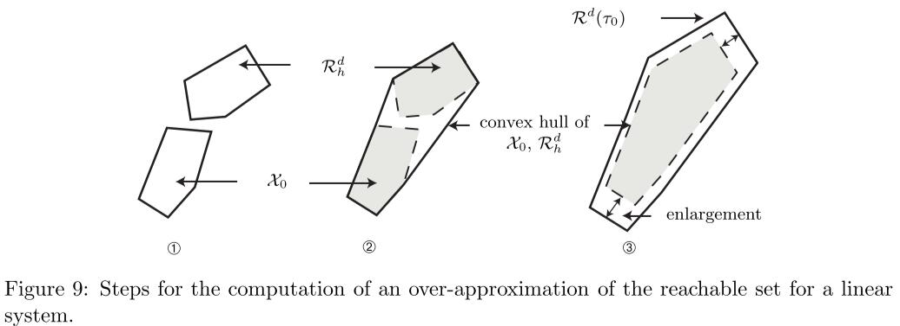

# Chapter 4 Dynamic Systems and Operations

- [Chapter 4 Dynamic Systems and Operations](#chapter-4-dynamic-systems-and-operations)
  - [4.1 Dynamic System Operations](#41-dynamic-system-operations)
    - [4.1.1 reach](#411-reach)
    - [4.1.2 simulate](#412-simulate)
    - [4.1.3 simulateRandom](#413-simulaterandom)
    - [4.1.4 simulateRRT](#414-simulaterrt)
    - [4.1.5 cora2spaceex](#415-cora2spaceex)
  - [4.2 Continuous Dynamics](#42-continuous-dynamics)
    - [4.2.1 Linear Systems](#421-linear-systems)
      - [4.2.1.1 Operation reach](#4211-operation-reach)
    - [4.2.2 Linear Systems with Uncertain Parameters](#422-linear-systems-with-uncertain-parameters)
      - [4.2.2.1 Operation reach](#4221-operation-reach)
    - [4.2.3 Linear Discrete-Time Systems](#423-linear-discrete-time-systems)
      - [4.2.3.1 Operation reach](#4231-operation-reach)
    - [4.2.4 Linear Probabilistic Systems](#424-linear-probabilistic-systems)
      - [4.2.4.1 Operation reach](#4241-operation-reach)
    - [4.2.5 Nonlinear Systems](#425-nonlinear-systems)
      - [4.2.5.1 Operation reach](#4251-operation-reach)
    - [4.2.6 Nonlinear Systems with Uncertain Parameters](#426-nonlinear-systems-with-uncertain-parameters)
      - [4.2.6.1 Operation reach](#4261-operation-reach)
    - [4.2.7 Nonlinear Discrete-Time Systems](#427-nonlinear-discrete-time-systems)
      - [4.2.7.1 Operation reach](#4271-operation-reach)
    - [4.2.8 Nonlinear Differential-Algebraic Systems](#428-nonlinear-differential-algebraic-systems)
      - [4.2.8.1 Operation reach](#4281-operation-reach)
  - [4.3 Hybrid Dynamics](#43-hybrid-dynamics)
    - [4.3.1 Hybrid Automata](#431-hybrid-automata)
      - [4.3.1.1 Operation reach](#4311-operation-reach)
    - [4.3.2 Parallel Hybrid Automata](#432-parallel-hybrid-automata)
      - [4.3.2.1 Operation reach](#4321-operation-reach)

> 本章中介绍了动态系统和其对应的操作


## 4.1 Dynamic System Operations

> 为了提高CORA的可用性，所有的动态系统都支持一系列操作，例如计算可达集合的"reach"操作。本章节(4.1)中介绍的时目前实现的常用操作。


### 4.1.1 reach

> reach操作计算一个动态系统的可达集合


##### 1.定义

动态系统的解(solution)记作：χ(t; x0, u(·), p)

> t：t∈R ，代表时间
>
> x<sub>0</sub>： x<sub>0</sub> = x(t<sub>0</sub>) ∈ R<sup>n</sup>，代表初始状态
>
> u(.)：u(.)∈R<sup>m</sup>，代表系统输入
>
> p：p∈R<sup>p</sup>，代表参数向量

t = t<sub>f</sub>时刻的可达集合可以使用上述的三个参数定义(除了t以外的另外三个参数)


由于精确的R<sup>e</sup>难以计算，因此往往采用近似计算，结算R<sup>e</sup>的tight enclosure R<sup>t</sup>,满足不等关系：R(t) ⊇ R<sup>e</sup>(t).


CORA中reach操作的语法如下：

```
R = reach(sys, params, options) 
[R, res] = reach(sys, params, options, spec)
```

> ###### 输入参数
>
> sys：在4.2/4.3中介绍的任意一种动态系统，如"linearSys"
>
> params：包含定义可达性问题所有参数的结构
>
> - .tStart：起始时间t<sub>0</sub>，默认值为0
> - .tFinal：最终时间t<sub>f</sub>
> - .R0：在2.2.1中介绍的任意一种集合表示的起始集合
> - .U：输入集合U，以Zonotope类的实例形式传入
> - .u：输入集合U(t) := uc(t)⊕U基于时间的中心u<sub>c</sub>(t)。以矩阵的形式体现，其列的值与可达性分析的步骤相同(可选项)
> - .paramInt：参数值集合P，形式为interval类
> - .y0guess：一致输入代数状态(a consistent initial algebraic state)的猜测，仅nonlinDASys类需要
> - .startLoc：初始位置的index(仅hybridAutomaton类和 parallelHybridAutomaton类需要)
> - .finalLoc：最终位置的index。当到达最终位置时，可达性分析立即停止(仅hybridAutomaton类和 parallelHybridAutomaton类需要))
>
> options：包含用于可达性分析算法的相关设置的结构，每个算法的对应设置不同，因此在4.2和4.3中进行介绍
>
> spec：specfication类(Sec6.3中介绍)的实例，代表系统需要验证的内容。如果验证结果为规格被违反，则可达性分析立刻停止
>
> 
>
> ###### 输出参数
>
> R：reachSet类的实例，存储t<sub>i</sub>时刻的可达集合R(t<sub>i</sub>)和T<sub>i</sub>区间的可达集合R(<sub>Ti</sub>)   （T<sub>i</sub> = [t<sub>i</sub>,t<sub>i+1</sub>])
>
> res：布尔型的flag，表明规格(specification)是否被满足，满足时res==1，否则为0


##### 2.示例

```matlab
% system dynamics 
sys = linearSys([-0.7 -2;2 -0.7],[1;1],[-2;-1]);

% parameter 
params.tFinal = 5; 
params.R0 = zonotope(interval([2;2],[2.5;2.5])); 
params.U = zonotope(interval(-0.1,0.1));

% reachability settings 
options.timeStep = 0.05; 
options.zonotopeOrder = 10; 
options.taylorTerms = 5;

% reachability analysis
R = reach(sys,params,options)
```


### 4.1.2 simulate

##### 1.定义

simulate操作模拟一个动态系统，根据初始状态x<sub>0</sub>、输入u(t)、参数p，计算轨迹。


在CORA中的simulate语法如下

```
[t, x] = simulate(sys, params) 
[t, x, ind] = simulate(sys, params, options)
```

> ###### 输入参数
>
> sys：在4.2/4.3中介绍的任意一种动态系统，如"linearSys"
>
> params：包含定义可达性问题所有参数的结构
>
> - .tStart：起始时间t<sub>0</sub>，默认值为0
>
> - .tFinal：最终时间t<sub>f</sub>
>
> - .x0：起始点x<sub>0</sub>
>
> - .u：以矩阵形式展示的分段常数输入信号u(t)，矩阵的行于系统的输入一致
>
>   e.g. 第一行：x x x x x x x
>
>   ​		第二行：x x x x x x x
>
> - .p：参数值p(仅nonlinParamSys类需要)
>
> - .y0guess：一致输入代数状态(a consistent initial algebraic state)的猜测，仅nonlinDASys类需要
>
> - .startLoc：初始位置的index(仅hybridAutomaton类和 parallelHybridAutomaton类需要)
>
> - .finalLoc：最终位置的index。当到达最终位置时，可达性分析立即停止(仅hybridAutomaton类和 parallelHybridAutomaton类需要))
>
> options：MATLAB的ode45方法需要的模拟选项
>
> 
>
> ###### 输出参数
>
> t：模拟轨迹的时间点(timep point)
>
> x：模拟轨迹的状态
>
> ind：MATLAB的ode45方法触发的事件方法的index


##### 2.示例

```matlab
% nonlinear system 
f = @(x,u) [x(2) + u; ... (1-x(1)ˆ2)*x(2)-x(1)];
sys = nonlinearSys(f);

% parameter 
params.x0 = [1.4;2.3]; 
params.tFinal = 6; 
params.u = [0.1 0 -0.1 0.2];

% simulation
[t,x] = simulate(sys,params);
```


### 4.1.3 simulateRandom

##### 1.定义

simulateRandom操作模拟一个初始状态、输入值、参数均有多个的动态系统

(x<sub>0</sub>∈X<sub>0</sub>;u(t)∈U;p∈P)


在CORA中的simulateRandom语法如下

```
simRes = simulateRandom(sys, params, options)
```

> ###### 输入参数
>
> sys：在4.2/4.3中介绍的任意一种动态系统，如"linearSys"
>
> params：simulateRandom的param参数和reach操作的param参数一致
>
> options：包含随机模拟的设置的结构
>
> - .points：随机初始状态的个数(需要是正整数)
> - .fracVert：从初始状态集合X<sub>0</sub>的顶点中随机提取的初始状态的比例，需要是一个[0,1]之间的值
> - .fracInpVert：从输入集合U的顶点中随机提取的初始状态的比例，需要是一个[0,1]之间的值
> - .inpChanges：模拟过程中改变的输入信号的数量，需要是一个非负整数
>
> 
>
> ###### 输出参数
>
> simRes：simResult类(Sec6.2中介绍)的实例，存储模拟得到的所有轨迹。


##### 2.示例

```matlab
% system dynamics 
sys = linearSys([-0.7 -2;2 -0.7],[1;1],[-2;-1]);

% parameter 
params.tFinal = 5; 
params.R0 = zonotope(interval([2;2],[2.5;2.5]));
params.U = zonotope(interval(-0.1,0.1));

% simulation settings 
options.points = 7; 
options.fracVert = 0.5; 
options.fracInpVert = 1; options.inpChanges = 10;

% random simulation
simRes = simulateRandom(sys,params,options);
```


### 4.1.4 simulateRRT

RRT：rapidly exploring random trees，快速探索随机数，一种路径规划算法


##### 1.定义

simulateRTT操作使用RTT算法模拟动态系统，这样做的目的是确定初始状态、输入和参数，从而能够获得尽可能好的轨迹


在CORA中，simulateRTT的语法如下：

```
simRes = simulateRRT(sys, R, params, options)
```

> ###### 输入参数
>
> sys：在4.2/4.3中介绍的任意一种动态系统，如"linearSys"
>
> R：reachSet类(Sec6.1中介绍)的实例，保存可达性问题的所有可达集合
>
> params：包含定义可达性问题的参数的结构。此参数与reach操作的对应参数一致
>
> options：包含随机模拟设置的结构
>
> - .points：随机初始状态的数量(正整数)
> - .vertSamp：表明初始状态、输入、参数是否从对应的集合中采样的flag(其值为0或1)
> - .strechFac：在算法执行时对可达集合进行膨胀的拉伸系数(取值范围为>1)
>
> 
>
> ###### 输出参数
>
> simRes：simResult类的实例，存储所有的模拟得到的轨迹


##### 2.示例

```matlab
% system dynamics 
sys = linearSys([-0.7 -2;2 -0.7],[1;1],[-2;-1]);

% parameter 
params.tFinal = 5; 
params.R0 = zonotope(interval([2;2],[2.5;2.5])); 
params.U = zonotope(interval(-0.1,0.1));

% reachability settings 
options.timeStep = 0.05; 
options.zonotopeOrder = 10; 
options.taylorTerms = 5;

% reachability analysis 
R = reach(sys,params,options);

% simulation settings 
simOptions.points = 20; 
simOptions.vertSamp = 0; simOptions.strechFac = 1.5;

% simulation with RRTs
simRes = simulateRRT(sys,R,params,simOptions);
```


### 4.1.5 cora2spaceex

将CORA对象转换为SpaceEx模型的方法，介绍略


## 4.2 Continuous Dynamics

这一部分介绍不同的用于表示连续动态系统(continuous dynamics)的类


CORA中使用下述8个类支持了连续动态系统的表示：

- Linear systems 
- Linear systems with uncertain parameters
- Linear discrete-time systems 
- Linear probabilistic systems
- Nonlinear systems
- Nonlinear systems with uncertain parameters 
- Nonlinear discrete-time systems 
- Nonlinear differential-algebraic systems 

上述的每个类都继承了父类contDynamics


### 4.2.1 Linear Systems

最简单的线性系统的形式如下


> x(t)∈R<sup>n</sup>,代表系统的状态
>
> u(t)∈R<sup>m</sup>，代表系统的输入
>
> y(t)∈R<sup>p</sup>，代表系统的输出
>
> (下面的A到k，均为系数)
>
> A∈R<sup>nxn</sup>
>
> B∈R<sup>nxm</sup>
>
> c∈R<sup>n</sup>
>
> C∈R<sup>pxn</sup>
>
> D∈R<sup>pxm</sup>
>
> k∈R<sup>p</sup>


CORA中，使用linearSys类实现了线性系统

```
sys = linearSys(A, B) 
sys = linearSys(A, B, c, C,D, k) 
sys = linearSys(name, A, B)
sys = linearSys(name, A, B, c, C,D, k)
```

> name：线性系统实例的名称，可选项


##### 示例

```matlab
% system matrices 
A = [-2 0; 1 -3]; 
B = [1; 1]; C = [1 0];

% linear system
sys = linearSys(A,B,[],C);
```


#### 4.2.1.1 Operation reach

在CORA中，实现了多个计算线性系统可达集合的算法。


作者推荐使用适应性算法(the adaptive algorithm)，因为这个算法不需要使用者输入任何参数进行调整。


线性系统的可达集合计算的过程为：

1. 通过将初始集合X<sub>0</sub>以及矩阵指数e<sup>A∆t</sup>进行传递，计算出下一时间点的可达集合R<sup>d</sup> <sub>h</sub> = e<sup>A∆t</sup>X0
2. 计算凸包(convex hull)
3. 根据凸包，使用一项误差项进行膨胀，以解释轨迹的曲率，从而得到T<sub>0</sub>时间区间内的可达集合的一个较精确的结果(a tight enclosure)




对于线性系统可达性分析的设置可以通过以下几项来实现

- .linAlg：指定使用哪种可达性算法，默认值是"standard"

- .timeStep：时间步长，除了"adpt"外的其余所有算法都需要指定此项

- .taylorTerms：矩阵指数e<sup>A∆t</sup>的计算中，泰勒项的个数，除了"adpt"外的其余所有算法都需要指定此项

- .zonotopeOrder：zonotope阶数$\rho$的上界，除了"adpt"外的其余所有算法都需要指定此项

- .reductionTechnique：指定减小zonotope阶数$\rho$的方法的项，默认值为"girard"

- .partition：指定每个block覆盖的维度范围的参数数组(所有的block组合成为线性系统)，仅算法"decomp"需要

- .krylovError：Krylov算法错误的上界，仅当选择算法"krylov"时需要

- .krylovStep：Krylov算法中，在错误比上界低时，用于增加Krylov子空间ξ 的步长，仅当选择算法"krylov"时需要

- .error：超精度项(over-approximative terms)中的错误的上界,仅算法"adpt

  "需要。默认值为初始集合的区间超精度估计的最长边的1/100


### 4.2.2 Linear Systems with Uncertain Parameters 

#### 4.2.2.1 Operation reach


### 4.2.3 Linear Discrete-Time Systems

#### 4.2.3.1 Operation reach


### 4.2.4 Linear Probabilistic Systems

#### 4.2.4.1 Operation reach


### 4.2.5 Nonlinear Systems

#### 4.2.5.1 Operation reach


### 4.2.6 Nonlinear Systems with Uncertain Parameters

#### 4.2.6.1 Operation reach


### 4.2.7 Nonlinear Discrete-Time Systems

#### 4.2.7.1 Operation reach


### 4.2.8 Nonlinear Differential-Algebraic Systems

#### 4.2.8.1 Operation reach


## 4.3 Hybrid Dynamics 

### 4.3.1 Hybrid Automata

#### 4.3.1.1 Operation reach


### 4.3.2 Parallel Hybrid Automata

#### 4.3.2.1 Operation reach