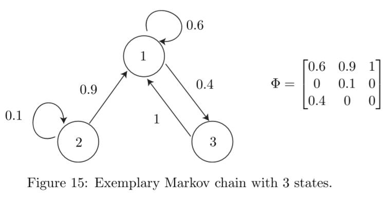
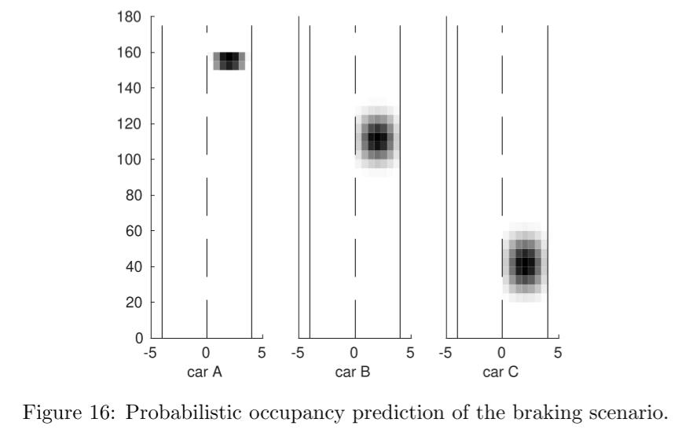

# Chapter 5 Abstraction to Discrete Systems

- [Chapter 5 Abstraction to Discrete Systems](#chapter-5-abstraction-to-discrete-systems)
  - [5.1 State Space Partitioning](#51-state-space-partitioning)
  - [5.2 Abstraction to Markov Chains](#52-abstraction-to-markov-chains)
  - [5.3 Stochastic Prediction of Road Vehicles](#53-stochastic-prediction-of-road-vehicles)

## 5.1 State Space Partitioning

> 有时，将状态空间划分为单元(cell)是很有用的。比如，对连续随机系统进行抽象，得到离散随机系统。
>
> CORA中，使用partition类支持对状态空间的轴对称划分。

partition类的主要方法如下：

1. cellCenter：返回一个cell数组，其元素为各个给定索引(indices)分段的单元中心位置
2. cellIndices：给定一个单元坐标的集合，返回所有单元的索引
3. cellIntervals：返回与输入单元对应的interval对象构成的数组
4. cellPolytopes：返回选中单元的Polytopes
5. cellSegments：给定单元索引的集合，返回所有单元的坐标
6. cellZonotopes：返回选中单元的Zonotopes
7. display：在MATLAB工作区中展示分块(partition)的参数
8. exactIntersectingCells：找出**确定**与集合P相交的所有单元，以及集合P与单元的重合部分
9. intersectingCells：通过将凸集(convex set)作为一个多维的interval进行超精度估计(overapproximating)，找出**可能**与一个连续集合相交的单元
10. nrOfCells：返回此partition包含的所有单元的数量
11. findSegments：返回与给定的多维interval相交的segments的索引
12. nrOfStates：返回此partition含有的离散状态的数量
13. partition：此类的构造函数
14. plot：展示此partition

## 5.2 Abstraction to Markov Chains

> - 使用马尔可夫链进行抽象的基本理念是，使用马尔可夫链对动态系统概率性地进行分析，而不是使用原始的系统动态
> - 为了能够对原始的系统在合理的精确度内进行近似，必须进行马尔可夫链抽象
> - 马尔可夫链抽象可以被应用于连续系统和混合系统
> - Sec5.1中介绍了对原始的系统状态空间和输入空间进行离散化的方法。由于马尔可夫链是具有离散状态空间的随机系统，因此必须对原始系统进行相应的离散化
> - 但是需要注意，由于使用马尔可夫链进行抽象后的结果会是原始连续状态空间的指数倍，因此马尔可夫链只能用于最高不超过4维的连续状态变量

markovchain类使用的马尔可夫链的定义如下：

MC = (Y , $\hat{p}^0$, Φ )

> - Y：位置的可数集合 ，满足Y $\subset$ N >0
>
> - $\hat{p}^0$：初始概率，满足$\hat{p}^0$= P(z(0) = i)
>   - z：$\Omega \to Y$的映射，其中$\Omega$是基本事件的集合
>   - P()：决定事件发生概率的运算符
> - Φ：转移矩阵，满足Φ~ij~ = P(z(k + 1) = i|z(k) = j)，即在第k个time step时状态为j的前提下，第k+1个time step状态为i的概率，从而使得$\hat{p}$(k + 1) = Φ$\hat{p}$(k).

马尔可夫链模型满足马尔可夫要求，即下一个时间步长的概率分布仅取决于上一个时间步长。如果一个过程不满足这一要求，则可以将上一个时间步长的状态加入z中，并使用新的z进行计算。

`z∗(k)T = [z(k)T, z(k − 1)T, z(k − 2)T, . . . ]`

##### 状态数量为3的马尔可夫链轴模型示例

> 图中矩阵的列，即表示一个状态在下一个时间点进行转移的概率
>
> e.g. 第一列表示，下一时刻状态1有60%的可能不改变状态，也有40%的可能转为状态3 

##### 离散时间步长(time step)k与连续时间的关系

- 设置一个时间增量t ，t∈R^+^

- 每经过t的时间，马尔可夫链即根据转移概率矩阵进行更新

- 例如，在time step = k时，实际的时间为 k * t

  

CORA中markovchain类支持如下的马尔可夫链相关方法：

1. build：使用模拟构建马尔可夫链的转移矩阵
2. build_reach：使用可达性分析构建马尔可夫链的转移矩阵
3. convertTransitionMatrix：将马尔可夫链的转移矩阵进行转换，以便能够如[56]中介绍的那样进行优化更新
4. markovchain：本类的构造方法
5. plot：生成马尔可夫链的三个图表
   - 采样得到的轨迹
   - 最终时间可达的单元(复数)
   - 时间区间内的可达单元(复数)
6. plot_reach：生成马尔可夫链的三个图表(与plot方法仅有一幅图不同)
   - 采样得到的轨迹和连续的可达集合
   - 最终时间可达的单元(复数)
   - 时间区间内的可达单元(复数)
7. plotP：打印马尔可夫链的2D概率分布

## 5.3 Stochastic Prediction of Road Vehicles

本部分中，作者介绍了使用马尔可夫链对交通参与者进行概率预测。通过这种方式，不仅可以判断是否会出现交通事故，还可以计算出现事故的概率。

作者提到，使用马尔可夫链进行计算有三个优势：

1. 可以处理表示交通参与者的混合系统(hybrid system)
2. 连续状态变量的数量不多(速度、位置)
3. 马尔可夫链模型的计算量相应地也就不大

作者还提供了相关的例子[27 Sec5]供参考

