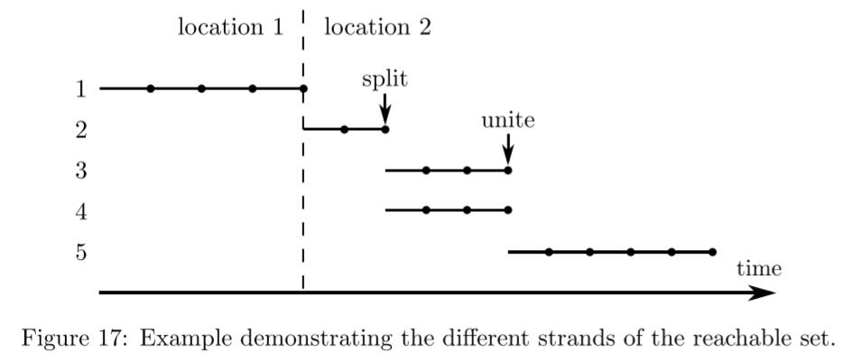

# Chapter 6 Additional Functionality

本章节中，会介绍CORA中实现的基础功能之外的额外功能


- [Chapter 6 Additional Functionality](#chapter-6-additional-functionality)
  - [6.1 Class reachSet](#61-class-reachset)
    - [6.1.1 add](#611-add)
    - [6.1.2 find](#612-find)
    - [6.1.3 plot](#613-plot)
    - [6.1.4 plotOverTime](#614-plotovertime)
    - [6.1.5 query](#615-query)
  - [6.2 Class simResult](#62-class-simresult)
    - [6.2.1 add](#621-add)
    - [6.2.2 plot](#622-plot)
    - [6.2.3 plotOverTime](#623-plotovertime)
  - [6.3 Class specification](#63-class-specification)
    - [6.3.1 add](#631-add)
    - [6.3.2 check](#632-check)
  - [6.4 Restructuring Polynomial Zonotopes](#64-restructuring-polynomial-zonotopes)
  - [6.5 Evaluating the Lagrange Remainder](#65-evaluating-the-lagrange-remainder)
  - [6.6 Verified Global Optimization](#66-verified-global-optimization)
  - [6.7 Kaucher Arithmetic](#67-kaucher-arithmetic)
  - [6.8 Contractors](#68-contractors)


## 6.1 Class reachSet

可达集合以对象的形式存储在类reachSet中。reachSet实现了许多使用功能，能够为可达集合的计算提供便利。


CORA中reachSet对象可以由如下的方式进行构造

```
obj = reachSet(timePoint) 
obj = reachSet(timePoint, parent) 
obj = reachSet(timePoint, parent, loc) 
obj = reachSet(timePoint, timeInt) 
obj = reachSet(timePoint, timeInt, parent)
obj = reachSet(timePoint, timeInt, parent, loc)
```

> - timePoint：包含.set和.time属性的结构，存储在特定时间的可达集合
> - timeInt：包含.set ，.time和.algebraic属性的结构，存储时间区间内可达集合(**仅nonlinDASys类需要**)
> - parent：父可达集合的索引
> - loc：可达集合属于的位置的索引(**仅混合系统需要)**


可达集合可以包含多个绳索(strands)。混合系统的位置发生变化时，如果发生了可达集合的拆分或合并，则新的strands被创建。

e.g.




### 6.1.1 add

add方法将一个可达集合与另一个相加

```
obj = add(obj1, obj2) 
obj = add(obj1, obj2, parent)
```

> - obj1 , obj2均为reachSet的实例
> - parent为obj2对象根元素的父的索引


在整体可达集合由多个序列进行计算时，reachSet的add方法很有用

### 6.1.2 find

find方法返回满足指定条件的所有可达集合

```
res = find(obj, prop, val)
```

> obj：reachSet类的实例
>
> prop：指定条件的String，其可以取的值如下所示
>
> - 'location'：寻找所有指定位置对应的可达集合
> - 'parent'：寻找所有parent为指定项的可达集合
> - 'time'：寻找对应时间区间的所有可达集合
>
> val：被指定条件的理想值
>
> res：reachSet的实例，包含**所有**满足条件的可达集合


### 6.1.3 plot

plot方法将指定时间区间内的可达集合的边界进行2维投影的可视化

```
han = plot(obj) 
han = plot(obj, dim) 
han = plot(obj, dim, linespec)
han = plot(obj, dim, linespec, namevaluepairs)
```

> obj：reachSet类的实例
>
> han：MATLAB图像对象的句柄
>
> dim：Integer类型的向量，满足dim ∈ $\N^2_\le n$，指明可达集合的哪两个维度被投影(default value: dim = [1 2])
>
> linespec：指定线段样式的字段，如’--*r’
>
> namevaluepairs：对线段的样式进行更多调整的字段
>
> - 除了matlab提供的name-value对，CORA还支持了'Filled'，'Order'等


注意，对于离散时间系统，plot方法展示的是指定时间点的可达集合


### 6.1.4 plotOverTime

plotOverTime方法随着时间的推移对可达集合时间区间内的1维投影进行可视化

```
han = plotOverTime(obj) 
han = plotOverTime(obj, dim) 
han = plotOverTime(obj, dim, linespec),
han = plotOverTime(obj, dim, linespec, namevaluepairs)
```

> plotOverTime的相关属性和plot一致


### 6.1.5 query


## 6.2 Class simResult

### 6.2.1 add


### 6.2.2 plot


### 6.2.3 plotOverTime


## 6.3 Class specification

### 6.3.1 add


### 6.3.2 check


## 6.4 Restructuring Polynomial Zonotopes


## 6.5 Evaluating the Lagrange Remainder


## 6.6 Verified Global Optimization


## 6.7 Kaucher Arithmetic


## 6.8 Contractors